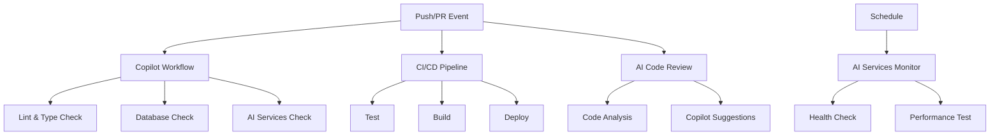

# GitHub Actions Workflow Status

## Overview
This document provides an overview of all GitHub Actions workflows in the Estimate Service project.

## Active Workflows

### 1. 🤖 AI-Enhanced Copilot Workflow (`copilot.yml`)
- **Purpose**: Primary CI workflow for linting, type checking, database validation, and AI services
- **Triggers**: Push to main/develop, Pull requests, Manual dispatch
- **Jobs**:
  - 📝 Lint & Type Check
  - 🗄️ Database Schema Check
  - 🤖 AI Services Validation
  - 🔗 Integration Readiness Check
- **Status**: ✅ Active

### 2. 🏗️ CI/CD Pipeline (`ci.yml`)
- **Purpose**: Simple CI pipeline for testing, building, and deployment
- **Triggers**: Push to main/production-sync, Pull requests to main
- **Jobs**:
  - Test (with PostgreSQL)
  - Build
  - Deploy (main branch only)
- **Status**: ✅ Active

### 3. 🤖 AI-Enhanced CI/CD Pipeline (`ci-cd.yml`)
- **Purpose**: Comprehensive CI/CD with quality checks, testing, and deployment
- **Triggers**: Push to main/develop, Pull requests, Manual dispatch
- **Jobs**:
  - 🔍 Code Quality Analysis
  - 🧪 Test Suite (unit, integration, e2e)
  - 🏗️ Build Application
  - 📚 Documentation Validation
  - 🤖 AI Code Review Preparation
  - ⚡ Performance Testing
  - 🚀 Deploy to Staging/Production
- **Status**: ✅ Active

### 4. 🤖 AI Code Review and Quality Check (`ai-code-review.yml`)
- **Purpose**: AI-powered code analysis and review suggestions
- **Triggers**: Pull requests (opened, synchronize, reopened), Manual dispatch
- **Jobs**:
  - 🧠 AI-Powered Code Analysis
  - 🧑‍💻 Generate Copilot Improvement Suggestions
- **Status**: ✅ Active

### 5. 📊 Documentation Quality Check (`docs-quality.yml`)
- **Purpose**: Validate and maintain documentation quality
- **Triggers**: Push with docs changes, Pull requests with docs changes, Manual dispatch
- **Jobs**:
  - 📝 Lint Documentation
  - 🔤 Spell Check
  - 🔗 Link Validation
  - 📊 Documentation Metrics
- **Status**: ✅ Active

### 6. 🤖 AI Services Monitor (`ai-services-monitor.yml`)
- **Purpose**: Monitor health and performance of AI services
- **Triggers**: Schedule (every 6 hours), Push to AI services, Manual dispatch
- **Jobs**:
  - 🏥 AI Services Health Check
  - ⚡ AI Performance Benchmark
- **Status**: ✅ Active

## Workflow Dependencies



## Environment Variables Required

### Common
- `NODE_VERSION`: '20'
- `DATABASE_URL`: PostgreSQL connection string
- `REDIS_URL`: Redis connection string

### AI Services
- `OPENAI_API_KEY`: For AI model access
- `HUGGINGFACE_API_KEY`: For Hugging Face models
- `MCP_SERVER_URL`: MCP server endpoint

### Deployment
- `DOCKER_REGISTRY`: Container registry URL
- `DEPLOY_KEY`: Deployment authentication
- `SENTRY_DSN`: Error tracking

## Maintenance Schedule

- **Daily**: Monitor workflow runs for failures
- **Weekly**: Review and update workflow dependencies
- **Monthly**: Audit workflow performance and optimize
- **Quarterly**: Major workflow updates and refactoring

## Troubleshooting

### Common Issues

1. **Nx workspace errors**
   ```bash
   npx nx reset
   ```

2. **Dependency installation failures**
   ```bash
   npm ci --workspaces --legacy-peer-deps
   ```

3. **Prisma generation errors**
   ```bash
   npx prisma generate
   ```

4. **AI service build failures**
   - Check service-specific logs
   - Verify environment variables
   - Ensure dependencies are up to date

## Contact

For workflow issues or improvements:
- Create an issue with the `ci/cd` label
- Contact the DevOps team
- Check the [CI/CD documentation](../docs/development/CI_CD_GUIDE.md)
