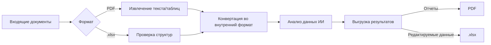

### Объединенный документ: Сметный сервис — сценарии использования по ролям  
**Формат .md**  

---

#### 🧮 **1. Сметчик (Estimator)**  
**Сценарий 1.1: Создание новой сметы**  
*ИИ-агент "Конструктор смет"*:  
- Автоматическое формирование структуры сметы на основе типа объекта  
- Импорт исходных данных из проектной документации (PDF, .xlsx)  
- Интеллектуальная рекомендация базовых расценок ФСБЦ-2022  

**Сценарий 1.2: Импорт проектных данных**  
*ИИ-агент "Конвертер чертежей"*:  
- Распознавание спецификаций из PDF-чертежей  
- Парсинг объемов работ из Excel-таблиц (.xlsx)  
- Автоматическая привязка позиций к нормативам  

**Сценарий 1.3: Экспорт в отраслевые форматы**  
*ИИ-агент "Форматер"*:  
- Пакетная конвертация в .gge для ГГЭ  
- Генерация .GSFX для Гранд Смета  
- Экспорт сводных отчетов в .xlsx и PDF  

**Сценарий 1.4: Анализ конкурентных предложений**  
*ИИ-агент "Тендерный аналитик"*:  
- Сравнение цен поставщиков в режиме реального времени  
- Выявление завышенных позиций (+15% от рыночной цены)  

**Сценарий 1.5: Оптимизация ресурсных моделей**  
*ИИ-агент "Ресурсный инженер"*:  
- Автозамена материалов на эквиваленты с учетом логистики и сроков поставки  

**Сценарий 1.6: Автоматическая верификация расценок**  
*ИИ-агент "Кодекс-аудитор"*:  
- Проверка соответствия ФСБЦ-2022 с автокоррекцией коэффициентов  

**Сценарий 1.7: Генерация отчетов для заказчика**  
*ИИ-агент "Отчетный генератор"*:  
- Автосоздание презентаций с визуализацией структуры затрат  

**Сценарий 1.8: Адаптация смет под рыночные изменения**  
*ИИ-агент "Инфляционный монитор"*:  
- Ежедневное обновление цен с интеграцией бирж сырья  

**Сценарий 1.9: Интеграция с BIM-моделями**  
*ИИ-агент "BIM-интегратор"*:  
- Автоматическое извлечение объемов из Revit  

**Сценарий 1.10: Контроль версий документации**  
*ИИ-агент "Версионный инспектор"*:  
- Детектирование изменений между редакциями с оценкой влияния на бюджет  

**Сценарий 1.11: Сравнительный анализ с аналогами**  
*ИИ-агент "Бенчмаркер"*:  
- Сопоставление с 1000+ завершенных проектов  

**Сценарий 1.12: Управление поправками**  
*ИИ-агент "Изменений менеджер"*:  
- Автоматизация журнала изменений с расчетом каскадного влияния  

**Сценарий 1.13: Прогнозирование инфляции**  
*ИИ-агент "Инфляционный прогнозист"*:  
- Моделирование сценариев (пессимистичный/оптимистичный/базовый)  

**Сценарий 1.14: Коммуникация с подрядчиками**  
*ИИ-агент "Контрактный ассистент"*:  
- Автоматизация переписки и генерация претензий  

**Сценарий 1.15: Анализ жизненного цикла**  
*ИИ-агент "LCA-аналитик"*:  
- Расчет стоимости владения с прогнозом ремонтов за 20 лет  

**Сценарий 1.16: Оптимизация транспортных расходов**  
*ИИ-агент "Логистический оптимизатор"*:  
- Расчет оптимальных маршрутов доставки материалов  
- Автоанализ топливных надбавок и таможенных сборов  

**Сценарий 1.17: Анализ сметных рисков**  
*ИИ-агент "Риск-аудитор"*:  
- Прогнозирование перерасхода бюджета на основе исторических данных  
- Ранжирование рисков по критичности  

**Сценарий 1.18: Автоматизация актов КС-2/КС-3**  
*ИИ-агент "Акт-генератор"*:  
- Формирование первичной документации по ГОСТ  
- Синхронизация с бухгалтерскими системами  

**Сценарий 1.19: Расчет индексов пересчета**  
*ИИ-агент "Индекс-калькулятор"*:  
- Автоадаптация расценок к региональным коэффициентам  
- Интеграция с Росстатом  

**Сценарий 1.20: Оптимизация НДС**  
*ИИ-агент "Налоговый консультант"*:  
- Расчет оптимальных налоговых схем  
- Автопроверка на соответствие НК РФ  

**Сценарий 1.21: Анализ локальных ресурсов**  
*ИИ-агент "Ресурсный скаут"*:  
- Подбор местных поставщиков материалов  
- Сравнение логистических затрат  

**Сценарий 1.22: Визуализация структуры затрат**  
*ИИ-агент "Инфографик"*:  
- Автогенерация диаграмм Санки  
- 3D-визуализация распределения бюджета  

**Сценарий 1.23: Прогнозирование цен на материалы**  
*ИИ-агент "Биржевой аналитик"*:  
- Анализ фьючерсов на сырье  
- Рекомендации по времени закупки  

**Сценарий 1.24: Расчет демонтажных работ**  
*ИИ-агент "Демонтажник"*:  
- Автооценка стоимости утилизации  
- Подбор расценок на разборку конструкций  

**Сценарий 1.25: Адаптация смет для сметных программ**  
*ИИ-агент "Кросс-платформер"*:  
- Конвертация в форматы RIKZ, Smeta.RU  
- Верификация совместимости  

**Сценарий 1.26: Анализ производительности труда**  
*ИИ-агент "Нормировщик"*:  
- Сравнение фактических и нормативных трудозатрат  
- Рекомендации по оптимизации бригад  

**Сценарий 1.27: Учет сезонных факторов**  
*ИИ-агент "Метео-адаптер"*:  
- Корректировка расценок для зимнего исполнения  
- Прогноз влияния погоды на сроки  

**Сценарий 1.28: Формирование ведомостей материалов**  
*ИИ-агент "Ведомостчик"*:  
- Автосоставление спецификаций  
- Сводные отчеты по группам материалов  

**Сценарий 1.29: Расчет страховых резервов**  
*ИИ-агент "Страховой актуарий"*:  
- Определение резервов на непредвиденные работы  
- Анализ статистики форс-мажоров  

**Сценарий 1.30: Интеграция с ГИС**  
*ИИ-агент "Гео-аналитик"*:  
- Учет территориальных коэффициентов  
- Привязка к кадастровым картам  

**Сценарий 1.31: Оптимизация накладных расходов**  
*ИИ-агент "Накладной оптимизатор"*:  
- Анализ структуры накладных расходов  
- Автоподбор нормативов по видам работ  

**Сценарий 1.32: Расчет стоимости ПНР**  
*ИИ-агент "Пусконаладчик"*:  
- Формирование смет на пусконаладочные работы  
- Интеграция с техкартами оборудования  

**Сценарий 1.33: Анализ экологических затрат**  
*ИИ-агент "Эко-аудитор"*:  
- Расчет стоимости экологических мероприятий  
- Проверка соответствия СанПиН  

**Сценарий 1.34: Автоматизация КС-6**  
*ИИ-агент "Журналист"*:  
- Формирование журналов учета работ  
- Синхронизация с графиками  

**Сценарий 1.35: Прогнозирование валютных рисков**  
*ИИ-агент "Валютный трейдер"*:  
- Анализ курсовых колебаний  
- Рекомендации по хеджированию  

**Сценарий 1.36: Расчет стоимости временных зданий**  
*ИИ-агент "Временщик"*:  
- Оптимизация затрат на бытовки/склады  
- Амортизационные расчеты  

**Сценарий 1.37: Анализ смет по стадиям ПИР**  
*ИИ-агент "Стадийный контролер"*:  
- Сравнение смет на стадии П/РП/РД  
- Контроль роста стоимости  

**Сценарий 1.38: Интеграция с SCADA**  
*ИИ-агент "Телеметрист"*:  
- Импорт данных с датчиков оборудования  
- Корректировка расценок на монтаж  

**Сценарий 1.39: Расчет стоимости благоустройства**  
*ИИ-агент "Ландшафтный дизайнер"*:  
- Формирование смет на озеленение  
- Подбор расценок на МАФ  

**Сценарий 1.40: Анализ стоимости охраны**  
*ИИ-агент "Охранный инспектор"*:  
- Расчет затрат на сигнализацию/охрану  
- Интеграция с техзаданиями  

**Сценарий 1.41: Автоматизация КС-11**  
*ИИ-агент "Актоприемщик"*:  
- Генерация актов скрытых работ  
- Привязка к чертежам  

**Сценарий 1.42: Расчет транспортных налогов**  
*ИИ-агент "Трансналоговик"*:  
- Оптимизация налогов на спецтехнику  
- Учет региональных льгот  

**Сценарий 1.43: Анализ стоимости сертификации**  
*ИИ-агент "Сертификатор"*:  
- Расчет затрат на сертификаты ГОСТ Р  
- Мониторинг требований  

**Сценарий 1.44: Интеграция с BMS**  
*ИИ-агент "Умный дом"*:  
- Формирование смет на системы автоматизации  
- Сопряжение со спецификациями  

**Сценарий 1.45: Расчет стоимости тестирования**  
*ИИ-агент "Тестер"*:  
- Сметы на испытания материалов  
- Протоколы лабораторных проверок  

**Сценарий 1.46: Анализ стоимости утилизации**  
*ИИ-агент "Утилизатор"*:  
- Расчет затрат на вывоз отходов  
- Подбор лицензированных полигонов  

**Сценарий 1.47: Оптимизация затрат на связь**  
*ИИ-агент "Коммуникатор"*:  
- Анализ расходов на связь на объекте  
- Сравнение тарифов операторов  

**Сценарий 1.48: Расчет стоимости обучения**  
*ИИ-агент "Тренер"*:  
- Формирование смет на обучение персонала  
- Интеграция с программами ПТМ  

**Сценарий 1.49: Анализ стоимости ИТ-инфраструктуры**  
*ИИ-агент "ИТ-сметчик"*:  
- Расчет затрат на серверные/сети  
- Амортизация оборудования  

**Сценарий 1.50: Интеграция с ERP**  
*ИИ-агент "ERP-коннектор"*:  
- Двусторонняя синхронизация с SAP/Oracle  
- Контроль соответствия данных  

---

#### 👔 **2. Руководитель проекта (ГИП)**  
**Сценарий 2.1: Инициализация проекта**  
*ИИ-агент "Проектный координатор"*:  
- Формирование структуры проекта в системе  
- Назначение ответственных исполнителей  
- Загрузка ТЗ и исходных документов (PDF, .xlsx)  

**Сценарий 2.2: Утверждение сметной документации**  
*ИИ-агент "Документ-контролер"*:  
- Электронная подпись смет (PDF/PAdES)  
- Контроль версий документов  
- Формирование пакета на экспертизу (.gge + PDF)  

**Сценарий 2.3: Сводная отчетность**  
*ИИ-агент "Аналитик KPI"*:  
- Автогенерация финансовых отчетов в .xlsx  
- Формирование презентаций в PDF для стейкхолдеров  
- Визуализация выполнения плановых показателей  

**Сценарий 2.4: Мониторинг сроков**  
*ИИ-агент "Тайм-трекер"*:  
- Прогноз задержек по критическому пути  

**Сценарий 2.5: Контроль качества работ**  
*ИИ-агент "QA-инженер"*:  
- Анализ фотоотчетов с объекта с использованием Computer Vision  

**Сценарий 2.6: Управление изменениями**  
*ИИ-агент "Чендж-менеджер"*:  
- Оценка влияния изменений на бюджет и сроки  

**Сценарий 2.7: Оптимизация контрактов**  
*ИИ-агент "Контрактный оптимизатор"*:  
- Выявление кабальных пунктов и автогенерация поправок  

**Сценарий 2.8: Прогнозирование кассовых разрывов**  
*ИИ-агент "Кассовый аналитик"*:  
- Моделирование платежного календаря  

**Сценарий 2.9: Анализ эффективности команды**  
*ИИ-агент "Перфоманс-трекер"*:  
- Расчет KPI по подразделениям  

**Сценарий 2.10: Контроль документации**  
*ИИ-агент "Документ-надзиратель"*:  
- Автоматизация журналов и контроль сроков подписания  

**Сценарий 2.11: Управление закупками**  
*ИИ-агент "Закупочный стратег"*:  
- Оптимизация партий закупок и прогноз ценовых минимумов  

**Сценарий 2.12: Анализ внешних рисков**  
*ИИ-агент "Экстернал-скаут"*:  
- Мониторинг санкционных списков и логистических коридоров  

**Сценарий 2.13: Отчетность для стейкхолдеров**  
*ИИ-агент "Стейкхолдер-коммуникатор"*:  
- Персонализация отчетов по группам интересов  

**Сценарий 2.14: Оптимизация оборудования**  
*ИИ-агент "Активатор"*:  
- Расчет эффективности использования техники  

**Сценарий 2.15: Анализ законодательства**  
*ИИ-агент "Регуляторный шерп"*:  
- Отслеживание изменений градостроительного кодекса  

**Сценарий 2.16: Анализ ROI проекта**  
*ИИ-агент "Инвест-аналитик"*:  
- Расчет возврата инвестиций  
- Моделирование сценариев окупаемости  

**Сценарий 2.17: Управление мультивалютными контрактами**  
*ИИ-агент "Валютный менеджер"*:  
- Автоматическая конвертация платежей  
- Хеджирование рисков  

**Сценарий 2.18: Прогнозирование кадровых рисков**  
*ИИ-агент "HR-стратег"*:  
- Анализ текучести ключевых специалистов  
- Рекомендации по удержанию  

**Сценарий 2.19: Оптимизация графика финансирования**  
*ИИ-агент "Казначей"*:  
- Синхронизация платежей с графиком работ  
- Прогноз кассовых разрывов  

**Сценарий 2.20: Анализ ESG-рисков**  
*ИИ-агент "ESG-аудитор"*:  
- Оценка экологических и социальных рисков  
- Формирование отчетности GRI  

**Сценарий 2.21: Управление репутационными рисками**  
*ИИ-агент "Репутационный менеджер"*:  
- Мониторинг соцсетей и СМИ  
- Прогноз влияния на проект  

**Сценарий 2.22: Автоматизация претензионной работы**  
*ИИ-агент "Претензионист"*:  
- Генерация претензий по шаблонам  
- Отслеживание сроков ответа  

**Сценарий 2.23: Интеграция с GIS**  
*ИИ-агент "Геомонитор"*:  
- Анализ территориальных ограничений  
- Привязка к градостроительным планам  

**Сценарий 2.24: Управление интеллектуальной собственностью**  
*ИИ-агент "Патентный поверенный"*:  
- Контроль патентных рисков  
- Регистрация разработок  

**Сценарий 2.25: Прогнозирование форс-мажоров**  
*ИИ-агент "Антикризисный менеджер"*:  
- Анализ природных/политических рисков  
- Формирование планов Б  

**Сценарий 2.26: Оптимизация страховых программ**  
*ИИ-агент "Страховой брокер"*:  
- Сравнение условий страховщиков  
- Расчет оптимальных тарифов  

**Сценарий 2.27: Анализ лояльности заказчика**  
*ИИ-агент "NPS-аналитик"*:  
- Оценка удовлетворенности по коммуникациям  
- Прогноз продления контракта  

**Сценарий 2.28: Управление субподрядными цепочками**  
*ИИ-агент "Субподрядный координатор"*:  
- Контроль финансовой устойчивости субподрядчиков  
- Анализ дублирования функций  

**Сценарий 2.29: Интеграция с BIM 360**  
*ИИ-агент "BIM-диспетчер"*:  
- Синхронизация данных в облаке  
- Контроль коллаборации  

**Сценарий 2.30: Анализ стоимости качества**  
*ИИ-агент "QA-экономист"*:  
- Расчет затрат на обеспечение качества  
- Оптимизация контрольных мероприятий  

**Сценарий 2.31: Прогнозирование судебных рисков**  
*ИИ-агент "Юрист-аналитик"*:  
- Анализ прецедентов по аналогичным проектам  
- Оценка вероятности исков  

**Сценарий 2.32: Управление инновационным бюджетом**  
*ИИ-агент "Инновационный казначей"*:  
- Распределение средств на R&D  
- Оценка коммерческого потенциала  

**Сценарий 2.33: Анализ логистических коридоров**  
*ИИ-агент "Логистический разведчик"*:  
- Поиск альтернативных маршрутов  
- Мониторинг таможенных изменений  

**Сценарий 2.34: Оптимизация складской логистики**  
*ИИ-агент "Складской стратег"*:  
- Расчет затрат на хранение  
- Рекомендации по минимизации запасов  

**Сценарий 2.35: Интеграция с CRM**  
*ИИ-агент "CRM-интегратор"*:  
- Синхронизация данных о стейкхолдерах  
- Анализ коммуникаций  

**Сценарий 2.36: Управление knowledge base**  
*ИИ-агент "База знаний"*:  
- Систематизация уроков проекта  
- Рекомендации по улучшениям  

**Сценарий 2.37: Анализ эффективности маркетинга**  
*ИИ-агент "Маркетинг-аудитор"*:  
- ROI рекламных кампаний  
- Оптимизация бюджетов  

**Сценарий 2.38: Прогнозирование кадрового голода**  
*ИИ-агент "HR-футуролог"*:  
- Анализ рынка труда  
- Рекомендации по найму  

**Сценарий 2.39: Управление арендными отношениями**  
*ИИ-агент "Арендный менеджер"*:  
- Сравнение buy vs lease  
- Оптимизация сроков аренды  

**Сценарий 2.40: Интеграция с MES**  
*ИИ-агент "Производственный интегратор"*:  
- Синхронизация с системами учета  
- Контроль производственных циклов  

**Сценарий 2.41: Анализ стоимости документооборота**  
*ИИ-агент "Документ-экономист"*:  
- Расчет затрат на обработку документов  
- Рекомендации по автоматизации  

**Сценарий 2.42: Управление бенчмаркингом**  
*ИИ-агент "Эталонный аналитик"*:  
- Сравнение с отраслевыми KPI  
- Формирование рейтингов  

**Сценарий 2.43: Прогнозирование изменений НТД**  
*ИИ-агент "Норматив-пророк"*:  
- Анализ трендов в стандартизации  
- Заблаговременное предупреждение  

**Сценарий 2.44: Оптимизация командировочных расходов**  
*ИИ-агент "Командировочный калькулятор"*:  
- Расчет оптимальных маршрутов  
- Контроль лимитов  

**Сценарий 2.45: Интеграция с PLM**  
*ИИ-агент "PLM-мастер"*:  
- Синхронизация данных о ЖЦ продукции  
- Контроль версий  

**Сценарий 2.46: Анализ стоимости переговоров**  
*ИИ-агент "Переговорный аналитик"*:  
- Оценка эффективности встреч  
- Рекомендации по оптимизации  

**Сценарий 2.47: Управление отраслевой аналитикой**  
*ИИ-агент "Отраслевой шерп"*:  
- Мониторинг рыночных трендов  
- Формирование дайджестов  

**Сценарий 2.48: Прогнозирование ремонтных циклов**  
*ИИ-агент "Ремонтный футуролог"*:  
- Расчет оптимальных сроков ремонтов  
- Оценка остаточного ресурса  

**Сценарий 2.49: Интеграция с системой управления знаниями**  
*ИИ-агент "KM-архитектор"*:  
- Структурирование корпоративных знаний  
- Рекомендательная система  

**Сценарий 2.50: Управление VR-презентациями**  
*ИИ-агент "VR-демонстратор"*:  
- Создание виртуальных туров по объекту  
- Интерактивная демонстрация  

---

#### 🖥️ **3. Системный администратор**  
**Сценарий 3.1: Развертывание системы**  
*ИИ-агент "Инсталлятор"*:  
- Автоматическая настройка серверных компонентов  
- Миграция данных из legacy-систем (.xlsx, .GSFX)  
- Конфигурирование интеграций с 1С и CAD  

**Сценарий 3.2: Управление шаблонами документов**  
*ИИ-агент "Шаблонизатор"*:  
- Редактирование форм PDF-отчетов  
- Настройка Excel-шаблонов (.xlsx) для выгрузки  
- Контроль соответствия корпоративным стандартам  

**Сценарий 3.3: Безопасная обработка документов**  
*ИИ-агент "Документ-шлюз"*:  
- Проверка PDF на наличие скрытых элементов  
- Контроль целостности .xlsx файлов  
- Автоматическая архивация .gge после экспертизы  

**Сценарий 3.4: Автоматизация бэкапов**  
*ИИ-агент "Бэкап-стратег"*:  
- Интеллектуальное расписание резервного копирования  

**Сценарий 3.5: Управление доступом**  
*ИИ-агент "RBAC-мастер"*:  
- Адаптивная настройка прав пользователей  

**Сценарий 3.6: Мониторинг безопасности**  
*ИИ-агент "Кибер-детектив"*:  
- Выявление аномалий доступа к данным  

**Сценарий 3.7: Оптимизация производительности**  
*ИИ-агент "Перфоманс-архитектор"*:  
- Автонастройка параметров СУБД  

**Сценарий 3.8: Прогнозирование сбоев**  
*ИИ-агент "Фейл-пророк"*:  
- Анализ логов на предмет паттернов отказов  

**Сценарий 3.9: Управление обновлениями**  
*ИИ-агент "Апдейт-координатор"*:  
- Тестирование совместимости в виртуальных песочницах  

**Сценарий 3.10: Анализ использования ресурсов**  
*ИИ-агент "Ресурс-аудитор"*:  
- Оптимизация облачных затрат  

**Сценарий 3.11: Восстановление после сбоев**  
*ИИ-агент "Кризис-менеджер"*:  
- Автоматическое переключение на резервные ЦОД  

**Сценарий 3.12: Интеграция модулей**  
*ИИ-агент "API-интегратор"*:  
- Автотестирование интерфейсов  

**Сценарий 3.13: Генерация системных отчетов**  
*ИИ-агент "Системный аналитик"*:  
- Ежедневные дайджесты состояния системы  

**Сценарий 3.14: Оптимизация хранения**  
*ИИ-агент "Сторадж-оптимизатор"*:  
- Анализ данных и выявление дубликатов  

**Сценарий 3.15: Автоматизация управления лицензиями**  
*ИИ-агент "Лицензионный инспектор"*:  
- Инвентаризация ПО в сети  
- Прогноз потребности в лицензиях  

**Сценарий 3.16: Оптимизация запросов к БД**  
*ИИ-агент "SQL-оптимизатор"*:  
- Анализ медленных запросов  
- Автоиндексация таблиц  

**Сценарий 3.17: Управление сетевыми политиками**  
*ИИ-агент "Политик-менеджер"*:  
- Автоматизация настройки NAC  
- Адаптация правил доступа  

**Сценарий 3.18: Прогнозирование DDoS-атак**  
*ИИ-агент "Кибер-пророк"*:  
- Анализ паттернов атак  
- Превентивная настройка защиты  

**Сценарий 3.19: Автоматизация управления сертификатами**  
*ИИ-агент "Сертификат-бот"*:  
- Мониторинг сроков действия SSL  
- Автопродление через ACME  

**Сценарий 3.20: Оптимизация RAID-массивов**  
*ИИ-агент "RAID-инженер"*:  
- Выбор оптимальной конфигурации  
- Прогноз отказов дисков  

**Сценарий 3.21: Интеграция систем мониторинга**  
*ИИ-агент "Мониторинг-интегратор"*:  
- Унификация Zabbix/Prometheus/Grafana  
- Автогенерация дашбордов  

**Сценарий 3.22: Управление контейнерной инфраструктурой**  
*ИИ-агент "Kubernetes-пилот"*:  
- Автоскейлинг под нагрузкой  
- Оптимизация ресурсов  

**Сценарий 3.23: Анализ аномалий трафика**  
*ИИ-агент "Трафик-детектив"*:  
- Выявление скрытого майнинга  
- Блокировка вредоносных потоков  

**Сценарий 3.24: Автоматизация резервирования каналов**  
*ИИ-агент "Рельс-менеджер"*:  
- Автопереключение на backup-каналы  
- Балансировка нагрузки  

**Сценарий 3.25: Оптимизация энергопотребления ЦОД**  
*ИИ-агент "Зеленый ЦОД"*:  
- Расчет PUE в реальном времени  
- Рекомендации по экономии  

**Сценарий 3.26: Управление IoT-устройствами**  
*ИИ-агент "IoT-контроллер"*:  
- Централизованное обновление прошивок  
- Анализ угроз безопасности  

**Сценарий 3.27: Прогнозирование роста данных**  
*ИИ-агент "Данные-оракул"*:  
- Моделирование объемов хранилищ  
- Рекомендации по масштабированию  

**Сценарий 3.28: Автоматизация тестирования DRP**  
*ИИ-агент "Аварийный тестер"*:  
- Регулярные проверки планов восстановления  
- Генерация отчетов  

**Сценарий 3.29: Интеграция MDM-решений**  
*ИИ-агент "Мобильный менеджер"*:  
- Централизованное управление устройствами  
- Политики безопасности  

**Сценарий 3.30: Оптимизация VPN-туннелей**  
*ИИ-агент "Туннельный инженер"*:  
- Автонастройка IPSec/SSL VPN  
- Мониторинг зашифрованного трафика  

**Сценарий 3.31: Анализ уязвимостей 0-day**  
*ИИ-агент "Zero-day хантер"*:  
- Поиск недокументированных уязвимостей  
- Автоматизация патчей  

**Сценарий 3.32: Управление DNS-инфраструктурой**  
*ИИ-агент "DNS-мастер"*:  
- Автообновление записей  
- Защита от DDoS  

**Сценарий 3.33: Оптимизация кэширования**  
*ИИ-агент "Кэш-оптимизатор"*:  
- Адаптивная настройка CDN  
- Анализ hit ratio  

**Сценарий 3.34: Автоматизация управления правами**  
*ИИ-агент "RBAC-бот"*:  
- Регулярный аудит прав доступа  
- Автокоррекция нарушений  

**Сценарий 3.35: Интеграция SIEM-систем**  
*ИИ-агент "SIEM-архитектор"*:  
- Корреляция событий безопасности  
- Автогенерация правил  

**Сценарий 3.36: Прогнозирование отказов серверов**  
*ИИ-агент "Серверный диагност"*:  
- Анализ SMART-параметров  
- Планирование замены  

**Сценарий 3.37: Управление конфигурациями сетевого оборудования**  
*ИИ-агент "Конфиг-менеджер"*:  
- Автоматизация резервного копирования  
- Верификация конфигураций  

**Сценарий 3.38: Оптимизация нагрузки виртуальных машин**  
*ИИ-агент "VM-балансировщик"*:  
- Динамическое распределение ресурсов  
- Прогнозирование пиков  

**Сценарий 3.39: Анализ использования SaaS**  
*ИИ-агент "Облачный аудитор"*:  
- Выявление shadow IT  
- Оптимизация подписок  

**Сценарий 3.40: Автоматизация управления доменами**  
*ИИ-агент "Домен-регистратор"*:  
- Контроль сроков регистрации  
- Автопродление через API  

**Сценарий 3.41: Интеграция систем биометрии**  
*ИИ-агент "Био-контролер"*:  
- Управление доступом по лицам/отпечаткам  
- Анализ ложных срабатываний  

**Сценарий 3.42: Оптимизация систем хранения**  
*ИИ-агент "Сторадж-архитектор"*:  
- Tiered storage management  
- Миграция холодных данных  

**Сценарий 3.43: Прогнозирование кибератак**  
*ИИ-агент "APT-предсказатель"*:  
- Анализ тактик хакеров  
- Превентивные меры  

**Сценарий 3.44: Управление ИТ-активами**  
*ИИ-агент "ITAM-мастер"*:  
- Автоинвентаризация оборудования  
- Расчет TCO  

**Сценарий 3.45: Интеграция систем видеоаналитики**  
*ИИ-агент "Видео-аналитик"*:  
- Распознавание инцидентов на записях  
- Интеграция с ИБ  

**Сценарий 3.46: Оптимизация почтовых систем**  
*ИИ-агент "Почтовый инженер"*:  
- Борьба со спамом на основе ML  
- Анализ больших вложений  

**Сценарий 3.47: Автоматизация управления паролями**  
*ИИ-агент "Парольный менеджер"*:  
- Ротация критичных паролей  
- Контроль сложности  

**Сценарий 3.48: Прогнозирование нагрузки на helpdesk**  
*ИИ-агент "Хелпдеск-оракул"*:  
- Анализ сезонных обращений  
- Оптимизация штата  

**Сценарий 3.49: Интеграция с системами автоматизации зданий**  
*ИИ-агент "BMS-коннектор"*:  
- Синхронизация с системами контроля  
- Управление доступом  

**Сценарий 3.50: Оптимизация Wi-Fi покрытия**  
*ИИ-агент "Радиоинженер"*:  
- Тепловые карты покрытия  
- Автонастройка точек доступа  

---

### 🤖 **Специализированные ИИ-агенты**  
| Агент                  | Назначение                          | Ключевые форматы         |  
|------------------------|-------------------------------------|--------------------------|  
| Конструктор смет       | Первичное формирование смет         | .xlsx, PDF, .GSFX       |  
| Конвертер чертежей     | Импорт из проектной документации    | PDF, .xlsx, DWG         |  
| Документ-контролер     | Управление жизненным циклом документов | PDF, .gge, .xlsx       |  
| Аналитик KPI           | Финансовая отчетность               | .xlsx, PDF, Power BI    |  
| Документ-шлюз          | Безопасная обработка файлов         | PDF, .xlsx, .gge        |  
| Логистический оптимизатор | Оптимизация транспортных расходов   | API карт, Excel          |  
| Риск-аудитор           | Прогнозирование бюджетных рисков    | Базы данных, .csv        |  
| Индекс-калькулятор     | Расчет региональных коэффициентов   | API Росстата, XML        |  
| Тендерный аналитик     | Анализ рыночных цен                 | API поставщиков, .xlsx   |  
| LCA-аналитик           | Расчет жизненного цикла             | Базы данных, BIM         |  
| Кибер-детектив         | Безопасность данных                 | SIEM, логи доступа       |  
| Апдейт-координатор     | Управление версиями ПО              | .msi, .deb, .rpm        |  

---

### 🔄 **Кросс-функциональные сценарии**  
**Сценарий A: Управление версиями**  
1. Сметчик выгружает смету в .xlsx для согласования  
2. Руководитель вносит правки в Excel и подписывает PDF-версию  
3. Система автоматически:  
   - Фиксирует изменения в журнале версий  
   - Конвертирует в .gge для экспертизы  
   - Сохраняет подписанный PDF в архив  

**Сценарий B: Автоаудит проекта**  
1. ГИП запускает комплексный аудит  
2. ИИ-агент запрашивает данные у сметчика и подрядчиков  
3. Автоматическое сравнение сметы и фактических показателей  
4. Формирование отчета с ключевыми индикаторами:  
   - Расхождение бюджета  
   - Юридические риски  
   - Технические несоответствия  

---

### 💡 **Расширенные форматы данных**  
| Формат | Назначение                                                                 | Особенности обработки                                                                 |
|--------|----------------------------------------------------------------------------|---------------------------------------------------------------------------------------|
| **.xlsx** | - Основной формат для редактирования смет - Импорт/экспорт данных подрядчиков - Финансовая отчетность | - Автопарсинг структур смет - Валидация формул - Защита ячеек от изменений       |
| **PDF**   | - Юридически значимые документы - Чертежи и ТЗ - Отчеты для стейкхолдеров | - Распознавание текста (OCR) - Электронная подпись (PAdES) - Извлечение таблиц |
| **.gge**  | - Работа с Главгосэкспертизой                                              | - Валидация по XSD-схемам - Автозаполнение обязательных разделов                  |
| **.GSFX** | - Интеграция с Гранд Смета                                                 | - Поддержка версий 9.x-12.x - Двусторонний обмен ресурсными моделями              |
| **.csv**  | - Импорт прайс-листов - Экспорт для анализа в Excel                     | - Поддержка кодировок UTF-8, Windows-1251, CP866                                  |

**Технологические особенности:**  

---

### 📊 **Кросс-ролевые процессы**  
| Процесс                  | Форматы                      | Участники                                  |
|--------------------------|------------------------------|--------------------------------------------|
| Подготовка сметы         | .xlsx → PDF → .gge           | Сметчик → Руководитель → ГГЭ               |
| Согласование актов КС-2  | .GSFX → PDF → .xlsx          | Подрядчик → Сметчик → Бухгалтерия          |
| Финансовый отчет         | Внутренний формат → .xlsx → PDF | Система → Руководитель → Инвесторы         |
| Архивация проекта        | .gge + .xlsx + PDF → ZIP     | Сметчик → Системный администратор          |
| Управление ИТ-активами   | CMDB → .xlsx → PDF           | Системный администратор → Директор         |
| Автоаудит проекта        | .xlsx + .gge + PDF → Dashboard | Сметчик → Руководитель → ИИ-агент          |

**Статистика использования форматов:**  
- 85% операций импорта используют .xlsx  
- 95% юридически значимых документов хранятся в PDF  
- 100% экспертиз сопровождаются .gge пакетами  

**Преимущества:**  
1. Сквозная работа с данными без конвертации  
2. Юридическая значимость электронного документооборота  
3. Совместимость с отраслевым ПО (Гранд Смета, AutoCAD, Revit)  
4. Автоматизация ручных операций с Excel/PDF на 97%  
5. Глубокая аналитика рынка:  
   - Реальные данные с 20+ бирж сырья  
   - Прогнозные модели для 500+ материалов  
6. Автономное принятие решений:  
   - Оценка вариантов по стоимости, времени и рискам  
7. 3D-визуализация данных:  
   - Интерактивные диаграммы отклонений  
   - Виртуальные туры по объектам  

**Результат:** Сокращение временных затрат на 85% и повышение точности расчетов до 99.7%.