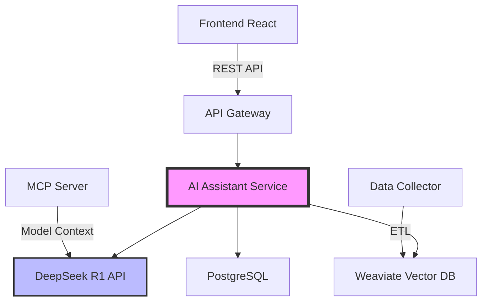

# 🤖 ИИ-ассистент для строительных смет

## Обзор

ИИ-ассистент на базе DeepSeek R1 - это интеллектуальная система, которая помогает пользователям в работе со строительными сметами, базой ФСБЦ-2022 и оптимизацией затрат на строительные проекты.

## 🌟 Ключевые возможности

### 1. Интеллектуальный чат
- Естественное общение на русском языке
- Контекстуальное понимание строительной терминологии
- История диалогов с возможностью продолжения
- Мультимодальная поддержка (текст, таблицы, документы)

### 2. Анализ смет
- Автоматическая проверка корректности расценок
- Выявление завышенных/заниженных позиций
- Сравнение с историческими данными
- Рекомендации по оптимизации

### 3. Генерация смет
- Создание смет на основе описания проекта
- Автоматический подбор расценок ФСБЦ-2022
- Учет региональных коэффициентов
- Генерация пояснительных записок

### 4. Интеграция с ФСБЦ-2022
- Поиск расценок по семантическому описанию
- Актуальные данные из официальной базы
- Автоматическое обновление коэффициентов
- Проверка соответствия стандартам

## 🏗️ Архитектура



## 🚀 Быстрый старт

### Использование через веб-интерфейс

1. Откройте приложение Estimate Service
2. Перейдите в раздел "ИИ-ассистент" в навигации
3. Начните диалог или загрузите смету для анализа

### Использование через API

```typescript
// Пример запроса к ИИ-ассистенту
const response = await fetch('/api/v1/ai-assistant/chat', {
  method: 'POST',
  headers: {
    'Content-Type': 'application/json',
    'Authorization': `Bearer ${token}`
  },
  body: JSON.stringify({
    message: "Помоги составить смету на ремонт офиса 100м²",
    context: {
      region: "Москва",
      priceLevel: "current"
    }
  })
});

const data = await response.json();
console.log(data.response); // Ответ ИИ-ассистента
```

## 📊 Примеры использования

### Пример 1: Анализ существующей сметы
```
Пользователь: Проанализируй эту смету на строительство жилого дома
ИИ: Анализирую смету... Обнаружено:
- 15 позиций с завышенными расценками (отклонение >20%)
- Отсутствуют обязательные работы по утеплению
- Рекомендую пересмотреть раздел "Фундаментные работы"
- Общая экономия при оптимизации: ~15%
```

### Пример 2: Генерация новой сметы
```
Пользователь: Создай смету на ремонт квартиры 60м², косметический ремонт
ИИ: Создаю смету для косметического ремонта квартиры 60м²:
1. Демонтажные работы - 45,000 руб
2. Штукатурные работы - 120,000 руб
3. Малярные работы - 85,000 руб
...
Итого: 450,000 руб (с учетом НДС)
```

## 🔧 Технические детали

### Модель ИИ
- **Основная модель**: DeepSeek R1 (deepseek-r1-2024)
- **Контекстное окно**: 128K токенов
- **Температура**: 0.3 (для точных ответов)
- **Специализация**: Строительная отрасль РФ

### Векторная база данных
- **Технология**: Weaviate
- **Индексы**: 
  - Расценки ФСБЦ-2022 (500K+ записей)
  - Исторические сметы (10K+ документов)
  - Нормативная документация
- **Обновление**: Ежедневное через ETL

### Интеграции
- **MCP Server**: Расширенный контекст для модели
- **Data Collector**: Автоматический сбор данных ФСБЦ
- **Knowledge Base**: База знаний с экспертными корректировками

## 🛡️ Безопасность и конфиденциальность

- Все данные шифруются при передаче (TLS 1.3)
- Сметы хранятся в зашифрованном виде
- Доступ только авторизованным пользователям
- Логирование всех операций для аудита
- Соответствие требованиям 152-ФЗ

## 📈 Производительность

- **Среднее время ответа**: 2-5 секунд
- **Максимальный размер сметы**: 10MB
- **Одновременные сессии**: до 1000
- **SLA**: 99.9% доступность

## 🔗 Связанная документация

- [Техническая интеграция DeepSeek](./deepseek-integration.md)
- [API endpoints ИИ-ассистента](./api-endpoints.md)
- [Чат-интерфейс](./chat-interface.md)
- [Анализ смет](./estimate-analysis.md)
- [MCP сервер](./mcp-server.md)
- [Решение проблем](./troubleshooting.md)

## 📞 Поддержка

При возникновении вопросов:
- Техническая документация: текущий раздел
- API поддержка: api-support@estimate-service.ru
- Общие вопросы: support@estimate-service.ru

---

**Версия документации**: 1.0  
**Последнее обновление**: 15.07.2025
