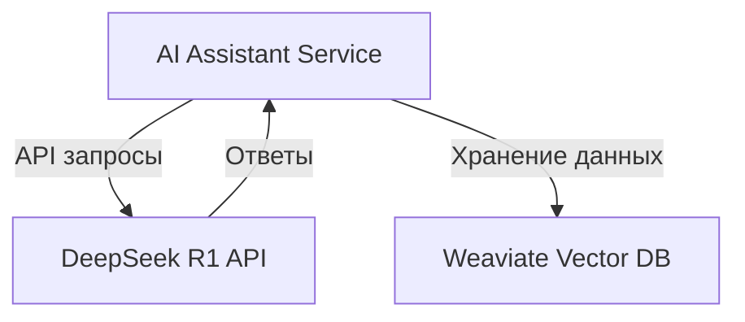

# 📘 Интеграция DeepSeek R1

## Введение

DeepSeek R1 представляет собой мощную платформу для анализа и обработки текста, обучения системы, основанного на машинном обучении. В этом документе описана интеграция с ИИ-ассистентом проекта.

## Архитектурная схема



## Требования

- Установите API ключ DeepSeek R1 в переменных окружения
- Убедитесь, что база данных Weaviate настроена и доступна
- Обеспечьте корректные разрешения для взаимодействия сервисов

## Использование

### 1. Запрос к API DeepSeek R1

Пример запроса для анализа текста:

```typescript
import axios from 'axios';

async function analyzeText(text) {
  const response = await axios.post('https://api.deepseek.com/v1/analyze', {
    text,
    language: 'ru'
  }, {
    headers: {
      'Authorization': `Bearer ${process.env.DEEPSEEK_API_KEY}`
    }
  });

  return response.data;
}
```

### 2. Обработка ответов

```javascript
function handleResponse(data) {
  const insights = data.insights;
  console.log(`Первичный анализ: ${insights.summary}`);
}
```

## Администрирование

- **Мониторинг API**: Используйте метрики и логи для контроля состояния API.
- **Лимиты запросов**: Убедитесь, что вы не превышаете лимиты использования, установленные DeepSeek.

## Часто задаваемые вопросы

1. **Что делать при превышении лимита запросов?**
   - Проверьте текущий usage и адаптируйте стратегию использования.

2. **Как исправить ошибки аутентификации?**
   - Проверьте корректность API ключа и его актуальность.

## Поддержка

Для технических вопросов и консультаций пишите на support@deepseek.com.
