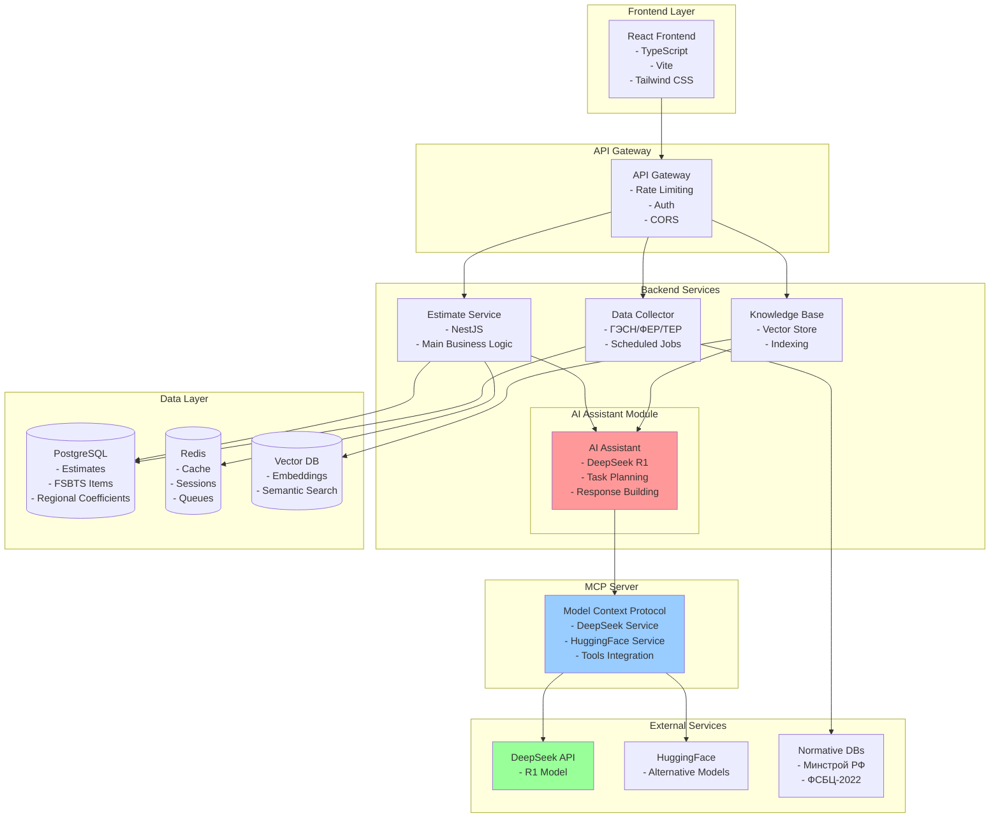
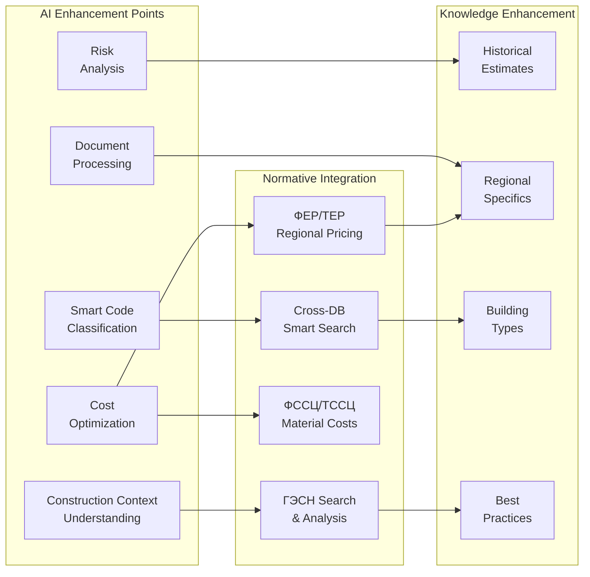
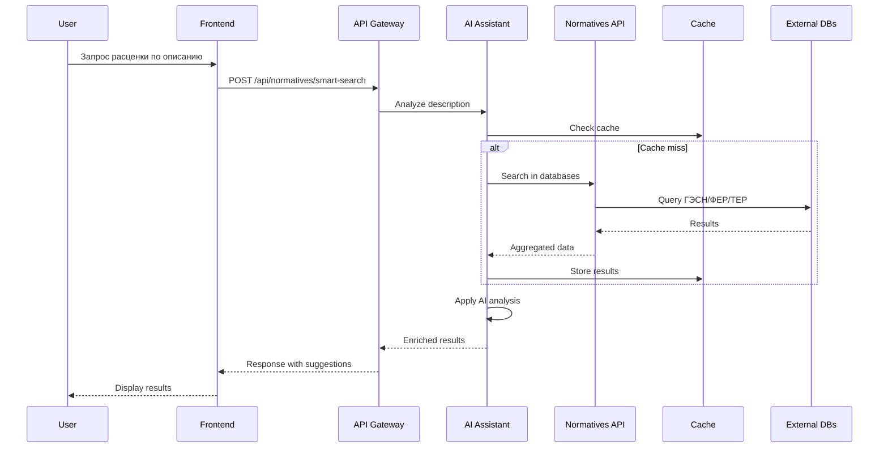
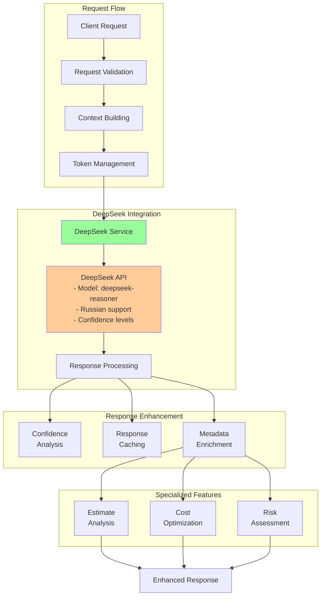
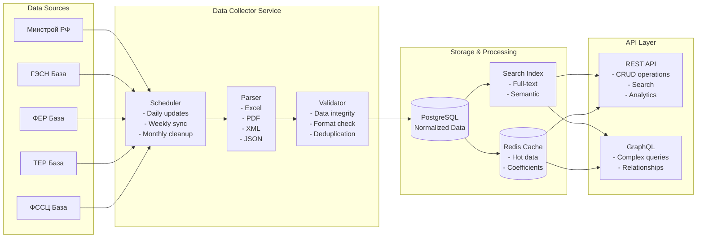
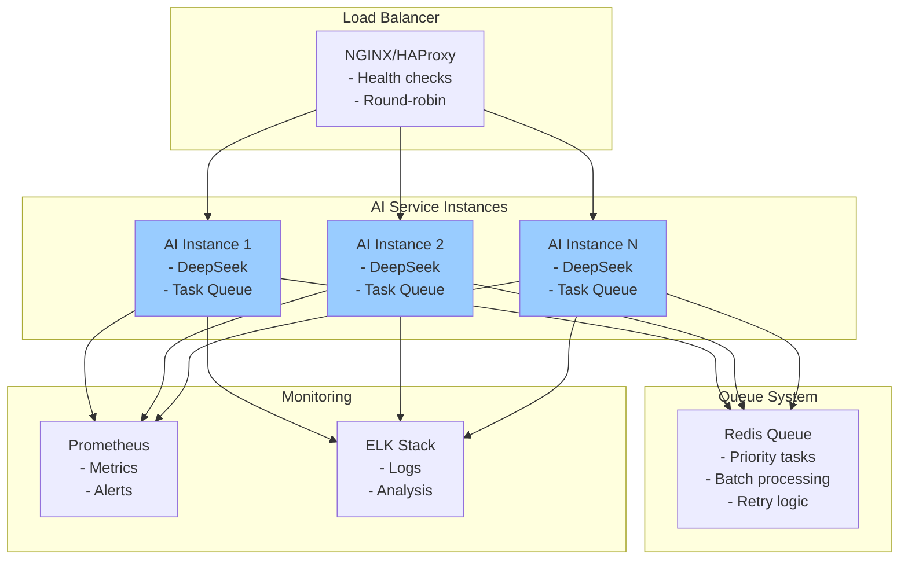

# Диаграмма архитектуры системы с точками интеграции AI

## Текущая архитектура системы

## Новые точки интеграции AI

## API структура для нормативных баз

## Архитектура DeepSeek R1 интеграции

## Поток данных нормативных баз

## Масштабирование AI сервисов

