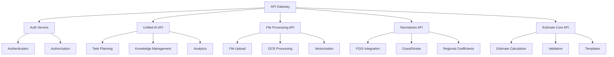

# План консолидации контроллеров

## Текущие проблемы
1. Функциональная фрагментация (32+ мелких контроллеров)
2. Дублирование логики (особенно в AI Assistant и авторизации)
3. Несоответствие документации (заявлено 86 контроллеров)

## Предлагаемая структура API



## Этапы реализации

### 1. Группировка контроллеров
| Домен              | Включаемые контроллеры                          |
|--------------------|-------------------------------------------------|
| Unified AI API     | Все AI-контроллеры из модуля ai-assistant       |
| Auth Service       | auth-simple.controller.ts, auth.controller.ts   |
| File Processing    | file-upload.controller.ts, fgis-vectorization   |
| Normatives API     | Все контроллеры fgis-cs-api и grand-smeta       |

### 2. Стандартизация
- Единые DTO для всех доменов
- Общие middleware для:
  - Аутентификации
  - Валидации
  - Логирования
  - Обработки ошибок

### 3. Миграция
1. Создание базовых классов для каждого домена
2. Поэтапный перенос функционала
3. Тестирование после каждого этапа миграции

### 4. Документирование
- Обновление Swagger-документации
- Создание миграционных руководств
- Обновление архитектурных схем

## График работ
```mermaid
gantt
    title График консолидации контроллеров
    dateFormat  YYYY-MM-DD
    section Группировка
    Анализ дублирования     :active,  des1, 2025-07-17, 3d
    Проектирование API      :         des2, after des1, 5d
    section Стандартизация
    Разработка DTO          :         des3, after des2, 3d
    Реализация middleware   :         des4, after des3, 4d
    section Миграция
    Перенос AI-модуля       :         des5, after des4, 5d
    Перенос авторизации     :         des6, after des5, 3d
    Тестирование            :         des7, after des6, 5d
