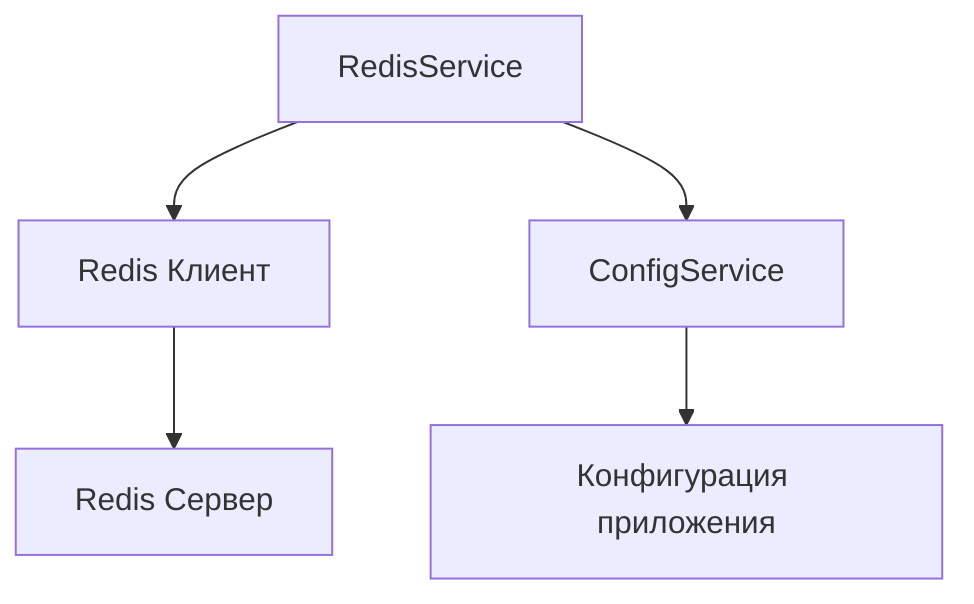

# Redis Module Documentation

## Назначение и обзор
Модуль Redis предоставляет унифицированный интерфейс для работы с Redis в рамках сервиса оценки. Основные функции:
- Кэширование данных для ускорения доступа
- Управление сессиями пользователей
- Хранение временных данных
- Реализация распределенных блокировок

## Архитектура и зависимости


Ключевые зависимости:
- `ioredis` - клиент Redis для Node.js
- `@nestjs/config` - для доступа к настройкам

## Основные методы и примеры использования
### Кэширование данных
```typescript
// Сохранение данных в кэш
await redisService.set('user:123', { name: 'Alex' }, 3600);

// Получение данных из кэша
const user = await redisService.get('user:123');
```

### Работа с хэшами
```typescript
// Сохранение поля в хэше
await redisService.hset('project:789', 'status', 'approved');

// Получение всех полей хэша
const projectData = await redisService.hgetall('project:789');
```

## Стратегии кэширования
1. **TTL по умолчанию** - 1 час для всех записей
2. **Паттерн инвалидации** - групповое удаление по маске:
```typescript
// Удаление всех ключей, связанных с пользователем
await redisService.deletePattern('user:123:*');
```

## Интеграция с другими сервисами
Redis интегрирован со следующими модулями:
1. **Сервис аутентификации** - хранение сессий
2. **Модуль AI-ассистента** - кэширование результатов запросов
3. **Сервис отчетов** - временное хранение сгенерированных отчетов
