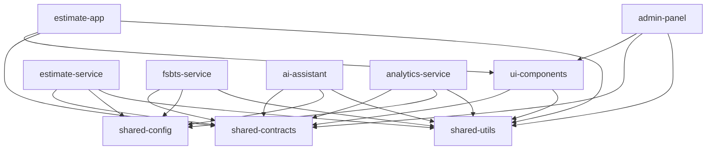

# Структура проекта

## Обзор архитектуры

Проект использует **Nx monorepo** архитектуру с микросервисным подходом. Все приложения и сервисы организованы в едином репозитории для упрощения разработки и сопровождения.

## Структура директорий

```
estimate-service/
├── .github/                           # GitHub Actions workflows
│   ├── workflows/
│   │   ├── ci.yml                     # Continuous Integration
│   │   ├── cd.yml                     # Continuous Deployment
│   │   ├── security.yml               # Security scanning
│   │   └── docs.yml                   # Documentation updates
│   └── ISSUE_TEMPLATE/                # Issue templates
├── .vscode/                           # VS Code настройки
│   ├── settings.json                  # Настройки проекта
│   ├── launch.json                    # Debug конфигурация
│   └── extensions.json                # Рекомендуемые расширения
├── apps/                             # Frontend приложения
│   ├── estimate-app/                 # Основное приложение для сметчиков
│   │   ├── src/
│   │   │   ├── app/
│   │   │   │   ├── components/       # React компоненты
│   │   │   │   ├── pages/            # Страницы приложения
│   │   │   │   ├── hooks/            # Custom hooks
│   │   │   │   ├── services/         # API клиенты
│   │   │   │   ├── store/            # State management
│   │   │   │   └── utils/            # Утилиты
│   │   │   ├── assets/               # Статические ресурсы
│   │   │   ├── styles/               # Глобальные стили
│   │   │   └── environments/         # Конфигурация окружений
│   │   ├── public/                   # Публичные файлы
│   │   ├── Dockerfile                # Docker образ
│   │   ├── project.json              # Nx конфигурация
│   │   └── tsconfig.json             # TypeScript конфигурация
│   ├── admin-panel/                  # Панель администратора
│   │   └── [аналогичная структура]
│   └── mobile-app/                   # Мобильное приложение (React Native)
│       └── [специфичная структура для RN]
├── services/                         # Backend микросервисы
│   ├── estimate-service/             # Основной сервис смет
│   │   ├── src/
│   │   │   ├── main.ts               # Точка входа
│   │   │   ├── app.module.ts         # Главный модуль
│   │   │   ├── modules/              # Бизнес модули
│   │   │   │   ├── ai-assistant/     # ИИ-ассистент (интегрирован)
│   │   │   │   │   ├── services/     # Сервисы ИИ
│   │   │   │   │   │   ├── task-planner.service.ts      # Планировщик задач
│   │   │   │   │   │   ├── response-builder.service.ts  # Построитель ответов
│   │   │   │   │   │   ├── historical-estimate.service.ts # Исторические данные
│   │   │   │   │   │   ├── claude-validator.service.ts  # Валидатор Claude
│   │   │   │   │   │   ├── fallback-handler.service.ts  # Обработчик ошибок
│   │   │   │   │   │   └── model-manager.service.ts     # Управление моделями
│   │   │   │   │   ├── controllers/  # API контроллеры
│   │   │   │   │   │   └── task-planner.controller.ts   # API планировщика
│   │   │   │   │   ├── interfaces/   # Интерфейсы
│   │   │   │   │   │   └── ai-task.interface.ts         # Типы задач ИИ
│   │   │   │   │   ├── providers/    # Провайдеры ИИ
│   │   │   │   │   │   ├── deepseek-ai.provider.ts      # DeepSeek интеграция
│   │   │   │   │   │   ├── yandex-ai.provider.ts        # Yandex интеграция
│   │   │   │   │   │   └── cached-ai.provider.ts        # Кэширование ИИ
│   │   │   │   │   ├── ai-assistant.service.ts          # Основной сервис
│   │   │   │   │   ├── ai-assistant.controller.ts       # Основной контроллер
│   │   │   │   │   └── ai-assistant.module.ts           # Модуль ИИ
│   │   │   │   ├── estimate/         # Управление сметами
│   │   │   │   │   ├── estimate.controller.ts
│   │   │   │   │   ├── estimate.service.ts
│   │   │   │   │   ├── dto/          # Data Transfer Objects
│   │   │   │   │   └── estimate.module.ts
│   │   │   │   ├── cache/            # Кэширование
│   │   │   │   ├── classification/   # Классификация работ
│   │   │   │   ├── priority-queue/   # Приоритезация задач
│   │   │   │   ├── validation/       # Валидация смет
│   │   │   │   └── templates/        # Шаблоны смет
│   │   │   ├── common/               # Общие компоненты
│   │   │   │   ├── filters/          # Exception filters
│   │   │   │   ├── interceptors/     # HTTP interceptors
│   │   │   │   ├── interfaces/       # Общие интерфейсы
│   │   │   │   └── services/         # Общие сервисы
│   │   │   ├── prisma/               # Prisma клиент
│   │   │   └── types/                # TypeScript типы
│   │   ├── test/                     # E2E тесты
│   │   ├── Dockerfile
│   │   ├── project.json
│   │   └── tsconfig.json
│   ├── analytics-service/            # Сервис аналитики
│   ├── data-collector/               # Сборщик данных
│   ├── template-service/             # Сервис шаблонов
│   ├── auth-service/                 # Аутентификация
│   └── notification-service/         # Уведомления
├── libs/                             # Общие библиотеки
│   ├── shared-contracts/             # Типы и интерфейсы
│   │   ├── src/
│   │   │   ├── estimate.types.ts     # Типы для смет
│   │   │   ├── fsbts.types.ts        # Типы ФСБЦ
│   │   │   ├── ai.types.ts           # Типы для ИИ
│   │   │   ├── auth.types.ts         # Типы аутентификации
│   │   │   └── index.ts              # Реэкспорт
│   │   └── project.json
│   ├── shared-utils/                 # Общие утилиты
│   │   ├── src/
│   │   │   ├── validation/           # Валидация
│   │   │   ├── formatting/           # Форматирование
│   │   │   ├── calculations/         # Математические функции
│   │   │   ├── date/                 # Работа с датами
│   │   │   └── string/               # Работа со строками
│   │   └── project.json
│   ├── shared-config/                # Общая конфигурация
│   │   ├── src/
│   │   │   ├── database.config.ts    # Настройки БД
│   │   │   ├── cache.config.ts       # Настройки кэша
│   │   │   ├── auth.config.ts        # Настройки аутентификации
│   │   │   └── app.config.ts         # Общие настройки
│   │   └── project.json
│   ├── shared-testing/               # Тестовые утилиты
│   │   ├── src/
│   │   │   ├── mocks/                # Моки для тестов
│   │   │   ├── factories/            # Test data factories
│   │   │   ├── fixtures/             # Тестовые данные
│   │   │   └── helpers/              # Помощники для тестов
│   │   └── project.json
│   └── ui-components/                # UI компоненты
│       ├── src/
│       │   ├── components/           # React компоненты
│       │   │   ├── Button/
│       │   │   ├── Input/
│       │   │   ├── Modal/
│       │   │   ├── Table/
│       │   │   └── EstimateCard/
│       │   ├── hooks/                # Custom hooks
│       │   ├── styles/               # Компонентные стили
│       │   └── utils/                # UI утилиты
│       └── project.json
├── infrastructure/                   # Инфраструктурные файлы
│   ├── docker/                       # Docker конфигурации
│   │   ├── development/              # Для разработки
│   │   ├── staging/                  # Для staging
│   │   └── production/               # Для продакшн
│   ├── kubernetes/                   # K8s манифесты
│   │   ├── base/                     # Базовые конфигурации
│   │   ├── overlays/                 # Оверлеи для окружений
│   │   │   ├── development/
│   │   │   ├── staging/
│   │   │   └── production/
│   │   └── secrets/                  # Секреты (шаблоны)
│   ├── terraform/                    # Infrastructure as Code
│   │   ├── modules/                  # Terraform модули
│   │   ├── environments/             # Окружения
│   │   └── scripts/                  # Скрипты развертывания
│   └── monitoring/                   # Мониторинг и логирование
│       ├── prometheus/               # Prometheus конфигурация
│       ├── grafana/                  # Grafana дашборды
│       ├── alertmanager/             # Алерты
│       └── logs/                     # Конфигурация логирования
├── docs/                             # Документация
│   ├── architecture/                 # Архитектурная документация
│   ├── api/                          # API документация
│   ├── user-guides/                  # Руководства пользователя
│   ├── development/                  # Документация для разработчиков
│   └── standards/                    # Стандарты и соглашения
├── tools/                            # Инструменты разработки
│   ├── scripts/                      # Скрипты автоматизации
│   │   ├── setup-dev.sh              # Настройка окружения разработки
│   │   ├── build-all.sh              # Сборка всех проектов
│   │   ├── test-all.sh               # Запуск всех тестов
│   │   └── deploy.sh                 # Развертывание
│   ├── generators/                   # Nx генераторы
│   │   ├── service/                  # Генератор микросервиса
│   │   ├── component/                # Генератор компонента
│   │   └── api/                      # Генератор API эндпоинта
│   └── webpack/                      # Webpack конфигурации
├── prisma/                           # Схемы баз данных
│   ├── schema.prisma                 # Основная схема
│   ├── migrations/                   # Миграции
│   ├── seeds/                        # Данные для заполнения
│   │   ├── development.ts            # Данные для разработки
│   │   ├── staging.ts                # Данные для staging
│   │   └── production.ts             # Минимальные продакшн данные
│   └── scripts/                      # Скрипты для БД
├── tests/                            # E2E и интеграционные тесты
│   ├── e2e/                          # End-to-end тесты
│   │   ├── estimate-flow.spec.ts     # Тестирование создания смет
│   │   ├── ai-assistant.spec.ts      # Тестирование ИИ-ассистента
│   │   └── user-management.spec.ts   # Тестирование пользователей
│   ├── integration/                  # Интеграционные тесты
│   │   ├── api/                      # API тесты
│   │   └── database/                 # Тесты БД
│   └── performance/                  # Нагрузочные тесты
│       ├── load-tests/               # Load testing
│       └── stress-tests/             # Stress testing
├── .env.example                      # Пример переменных окружения
├── .env.development                  # Переменные для разработки
├── .gitignore                        # Git ignore правила
├── .dockerignore                     # Docker ignore правила
├── docker-compose.yml                # Docker Compose для продакшн
├── docker-compose.dev.yml            # Docker Compose для разработки
├── nx.json                           # Nx конфигурация
├── package.json                      # Зависимости проекта
├── tsconfig.base.json                # Базовая TypeScript конфигурация
├── eslint.config.mjs                 # ESLint конфигурация
├── jest.config.ts                    # Jest конфигурация
├── jest.preset.js                    # Jest пресеты
├── README.md                         # Описание проекта
└── CHANGELOG.md                      # История изменений
```

## Nx Graph зависимостей



## Принципы организации кода

### 1. Разделение по доменам

Каждый сервис отвечает за свой домен:
- **estimate-service**: Управление сметами
- **fsbts-service**: Работа с базой ФСБЦ-2022
- **ai-assistant**: ИИ-функциональность
- **analytics-service**: Аналитика и отчеты

### 2. Слоистая архитектура

```typescript
// Пример структуры модуля
estimate/
├── estimate.controller.ts      // Presentation Layer
├── estimate.service.ts         // Business Logic Layer
├── estimate.repository.ts      // Data Access Layer
├── dto/                        // Data Transfer Objects
│   ├── create-estimate.dto.ts
│   ├── update-estimate.dto.ts
│   └── estimate-response.dto.ts
├── entities/                   // Domain Entities
│   └── estimate.entity.ts
├── guards/                     // Security Guards
├── decorators/                 // Custom Decorators
└── estimate.module.ts          // Module Definition
```

### 3. Shared Libraries

#### shared-contracts
```typescript
// libs/shared-contracts/src/estimate.types.ts
export interface Estimate {
  id: string;
  name: string;
  projectType: ProjectType;
  regionCode: string;
  totalCost: number;
  status: EstimateStatus;
  items: EstimateItem[];
  createdAt: Date;
  updatedAt: Date;
}

export enum ProjectType {
  RESIDENTIAL = 'RESIDENTIAL',
  COMMERCIAL = 'COMMERCIAL',
  INDUSTRIAL = 'INDUSTRIAL',
  INFRASTRUCTURE = 'INFRASTRUCTURE',
}

export enum EstimateStatus {
  DRAFT = 'DRAFT',
  REVIEW = 'REVIEW',
  APPROVED = 'APPROVED',
  REJECTED = 'REJECTED',
  ARCHIVED = 'ARCHIVED',
}
```

#### shared-utils
```typescript
// libs/shared-utils/src/calculations/cost.utils.ts
export class CostCalculator {
  static calculateVAT(amount: number, rate: number = 0.2): number {
    return amount * rate;
  }

  static applyRegionalCoefficient(
    basePrice: number,
    coefficient: number
  ): number {
    return basePrice * coefficient;
  }

  static roundToRubles(amount: number): number {
    return Math.round(amount);
  }
}
```

#### ui-components
```typescript
// libs/ui-components/src/components/Button/Button.tsx
export interface ButtonProps {
  variant?: 'primary' | 'secondary' | 'danger';
  size?: 'sm' | 'md' | 'lg';
  loading?: boolean;
  disabled?: boolean;
  children: React.ReactNode;
  onClick?: () => void;
}

export const Button: React.FC<ButtonProps> = ({
  variant = 'primary',
  size = 'md',
  loading = false,
  disabled = false,
  children,
  onClick,
}) => {
  // Реализация компонента
};
```

## Соглашения по именованию

### Файлы и директории
```
kebab-case для файлов и директорий:
✅ estimate-service/
✅ create-estimate.dto.ts
✅ user-profile.component.tsx

❌ EstimateService/
❌ CreateEstimate.dto.ts
❌ UserProfile.component.tsx
```

### TypeScript
```typescript
// Interfaces и Types - PascalCase
interface UserProfile { }
type EstimateStatus = 'draft' | 'approved';

// Classes - PascalCase
class EstimateService { }

// Enums - PascalCase, значения - UPPER_CASE
enum ProjectType {
  RESIDENTIAL = 'RESIDENTIAL',
  COMMERCIAL = 'COMMERCIAL',
}

// Variables и Functions - camelCase
const userName = 'John';
function calculateTotal() { }

// Constants - UPPER_CASE
const MAX_ESTIMATE_ITEMS = 1000;
const API_ENDPOINTS = {
  ESTIMATES: '/api/estimates',
} as const;
```

### React компоненты
```typescript
// Компоненты - PascalCase
export const EstimateForm = () => { };
export const UserProfileCard = () => { };

// Хуки - camelCase с префиксом use
export const useEstimate = () => { };
export const useUserProfile = () => { };

// Props интерфейсы - ComponentNameProps
interface EstimateFormProps { }
interface UserProfileCardProps { }
```

## Конфигурация инструментов

### Nx конфигурация
```json
// nx.json
{
  "extends": "nx/presets/npm.json",
  "affected": {
    "defaultBase": "origin/main"
  },
  "tasksRunnerOptions": {
    "default": {
      "runner": "nx/tasks-runners/default",
      "options": {
        "cacheableOperations": ["build", "lint", "test", "e2e"]
      }
    }
  },
  "targetDefaults": {
    "build": {
      "dependsOn": ["^build"],
      "inputs": ["production", "^production"]
    },
    "test": {
      "inputs": ["default", "^production", "{workspaceRoot}/jest.preset.js"]
    },
    "e2e": {
      "inputs": ["default", "^production"]
    },
    "lint": {
      "inputs": ["default", "{workspaceRoot}/.eslintrc.json"]
    }
  },
  "namedInputs": {
    "default": ["{projectRoot}/**/*", "sharedGlobals"],
    "production": [
      "default",
      "!{projectRoot}/**/?(*.)+(spec|test).[jt]s?(x)?(.snap)",
      "!{projectRoot}/tsconfig.spec.json",
      "!{projectRoot}/jest.config.[jt]s",
      "!{projectRoot}/src/test-setup.[jt]s",
      "!{projectRoot}/test-config.json"
    ],
    "sharedGlobals": []
  }
}
```

### TypeScript базовая конфигурация
```json
// tsconfig.base.json
{
  "compileOnSave": false,
  "compilerOptions": {
    "rootDir": ".",
    "sourceMap": true,
    "declaration": false,
    "moduleResolution": "node",
    "emitDecoratorMetadata": true,
    "experimentalDecorators": true,
    "importHelpers": true,
    "target": "es2015",
    "module": "esnext",
    "lib": ["es2020", "dom"],
    "skipLibCheck": true,
    "skipDefaultLibCheck": true,
    "baseUrl": ".",
    "strict": true,
    "noImplicitOverride": true,
    "noPropertyAccessFromIndexSignature": true,
    "noImplicitReturns": true,
    "noFallthroughCasesInSwitch": true,
    "paths": {
      "@estimate-service/shared-contracts": ["libs/shared-contracts/src/index.ts"],
      "@estimate-service/shared-utils": ["libs/shared-utils/src/index.ts"],
      "@estimate-service/shared-config": ["libs/shared-config/src/index.ts"],
      "@estimate-service/shared-testing": ["libs/shared-testing/src/index.ts"],
      "@estimate-service/ui-components": ["libs/ui-components/src/index.ts"]
    }
  },
  "exclude": ["node_modules", "tmp"]
}
```

## Скрипты автоматизации

### package.json scripts
```json
{
  "scripts": {
    // Development
    "dev": "nx serve estimate-app",
    "dev:all": "nx run-many --target=serve --all",
    
    // Building
    "build": "nx build estimate-app",
    "build:all": "nx run-many --target=build --all",
    "build:affected": "nx affected --target=build",
    
    // Testing
    "test": "nx test",
    "test:all": "nx run-many --target=test --all",
    "test:affected": "nx affected --target=test",
    "test:e2e": "nx e2e estimate-app-e2e",
    "test:coverage": "nx run-many --target=test --all --coverage",
    
    // Linting
    "lint": "nx run-many --target=lint --all",
    "lint:affected": "nx affected --target=lint",
    "lint:fix": "nx run-many --target=lint --all --fix",
    
    // Database
    "db:migrate": "prisma migrate dev",
    "db:seed": "prisma db seed",
    "db:reset": "prisma migrate reset",
    "db:studio": "prisma studio",
    
    // Docker
    "docker:build": "docker-compose build",
    "docker:up": "docker-compose up -d",
    "docker:down": "docker-compose down",
    "docker:logs": "docker-compose logs -f",
    
    // Deployment
    "deploy:staging": "./tools/scripts/deploy.sh staging",
    "deploy:production": "./tools/scripts/deploy.sh production",
    
    // Utilities
    "clean": "nx reset",
    "dep-graph": "nx dep-graph",
    "affected:graph": "nx affected:dep-graph"
  }
}
```

### Скрипт настройки окружения
```bash
#!/bin/bash
# tools/scripts/setup-dev.sh

echo "🚀 Настройка окружения разработки..."

# Проверка Node.js версии
required_node_version="20"
current_node_version=$(node -v | cut -d'v' -f2 | cut -d'.' -f1)

if [ "$current_node_version" -lt "$required_node_version" ]; then
    echo "❌ Требуется Node.js версии $required_node_version или выше"
    exit 1
fi

# Установка зависимостей
echo "📦 Установка зависимостей..."
npm ci

# Настройка базы данных
echo "🗃️ Настройка базы данных..."
cp .env.example .env.development
docker-compose -f docker-compose.dev.yml up -d postgres redis

# Ожидание запуска БД
echo "⏳ Ожидание запуска базы данных..."
sleep 10

# Применение миграций
echo "🔧 Применение миграций..."
npm run db:migrate

# Заполнение тестовыми данными
echo "📊 Заполнение тестовыми данными..."
npm run db:seed

# Проверка настройки
echo "✅ Проверка настройки..."
npm run test -- --testTimeout=5000 --testNamePattern="health check"

echo "🎉 Окружение настроено успешно!"
echo "💡 Запустите 'npm run dev' для начала разработки"
```

## Генераторы кода

### Nx генератор микросервиса
```typescript
// tools/generators/service/index.ts
import { Tree, formatFiles, generateFiles, joinPathFragments } from '@nx/devkit';

interface ServiceGeneratorSchema {
  name: string;
  port: number;
  database?: boolean;
}

export default async function (tree: Tree, options: ServiceGeneratorSchema) {
  const servicePath = `services/${options.name}`;
  
  generateFiles(tree, joinPathFragments(__dirname, 'files'), servicePath, {
    ...options,
    template: '',
  });

  // Обновление docker-compose
  updateDockerCompose(tree, options);
  
  await formatFiles(tree);
}

function updateDockerCompose(tree: Tree, options: ServiceGeneratorSchema) {
  // Логика обновления docker-compose.yml
}
```

## Мониторинг структуры

### Dependency Cruiser конфигурация
```javascript
// .dependency-cruiser.js
module.exports = {
  forbidden: [
    {
      name: 'no-circular',
      severity: 'error',
      comment: 'Circular dependencies are not allowed',
      from: {},
      to: {
        circular: true
      }
    },
    {
      name: 'no-orphans',
      severity: 'warn',
      comment: 'Orphan modules should be cleaned up',
      from: {
        orphan: true,
        pathNot: '\\.d\\.ts$'
      },
      to: {}
    },
    {
      name: 'apps-should-not-depend-on-apps',
      severity: 'error',
      comment: 'Apps should not depend on other apps',
      from: {
        path: '^apps/'
      },
      to: {
        path: '^apps/',
        pathNot: '^apps/[^/]+/'
      }
    }
  ]
};
```

Эта структура обеспечивает:
- 🔧 **Масштабируемость** - легко добавлять новые сервисы и приложения
- 🔄 **Переиспользование** - общие библиотеки для всех проектов
- 🧪 **Тестируемость** - четкое разделение для unit, integration и e2e тестов
- 🚀 **DevOps готовность** - инфраструктурные файлы и скрипты автоматизации
- 📚 **Документированность** - структурированная документация проекта
