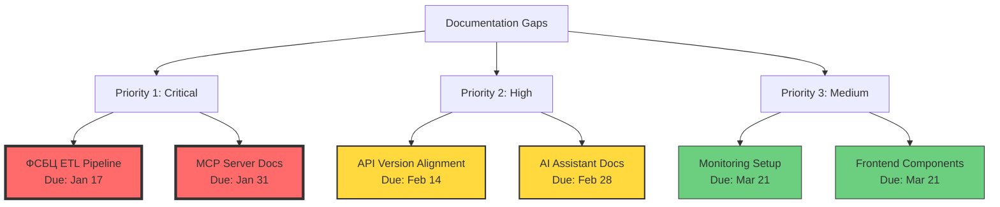

# 📊 Documentation Update Priorities - Visual Summary

## 🎯 Priority Matrix



## 📅 Timeline Overview

```
January 2025
├─ Week 1-2 (Jan 6-17): ФСБЦ ETL Pipeline ⚡
│  └─ Owner: Backend Team Lead + Data Engineer
├─ Week 3-4 (Jan 20-31): MCP Server Complete Docs ⚡
│  └─ Owner: AI Team Lead + Senior Developer
│
February 2025
├─ Week 5 (Feb 3-7): API Version Audit 🔍
│  └─ Owner: API Team Lead + Tech Writer
├─ Week 6 (Feb 10-14): API Documentation Update 📝
│  └─ Owner: Tech Writer + Backend Devs
├─ Week 7-8 (Feb 17-28): AI Assistant Docs 🤖
│  └─ Owner: AI Team + Product Manager
│
March 2025
└─ Week 9-10 (Mar 3-21): Monitoring & DevOps 📊
   └─ Owner: DevOps Team
```

## 🏆 Success Metrics Dashboard

| Component        | Coverage Target | Deadline | Team Size | Status         |
| ---------------- | --------------- | -------- | --------- | -------------- |
| **ФСБЦ ETL**     | 100%            | Jan 17   | 2 people  | 🔴 Not Started |
| **MCP Server**   | 100%            | Jan 31   | 2 people  | 🟡 25% Done    |
| **API Versions** | 100%            | Feb 14   | 2 people  | 🔴 Not Started |
| **AI Assistant** | 90%             | Feb 28   | 3 people  | 🔴 Not Started |
| **Monitoring**   | 85%             | Mar 21   | 2 people  | 🔴 Not Started |

## 🚦 Risk Indicators

### 🔴 High Risk Areas:

1. **ФСБЦ ETL** - No existing documentation
2. **API Versioning** - Inconsistencies across services

### 🟡 Medium Risk Areas:

1. **MCP Server** - Partial docs exist but scattered
2. **AI Assistant** - Complex integration points

### 🟢 Low Risk Areas:

1. **Monitoring** - Standard Prometheus/Grafana setup
2. **Frontend** - Storybook can auto-generate docs

## 📋 Quick Actions This Week

```
Monday    █████░░░░░ Set up ФСБЦ ETL doc structure
Tuesday   ██████████ Write pipeline architecture
Wednesday █████████░ Document data collection
Thursday  ████████░░ Create automation guides
Friday    █████████░ Review and validate
```

## 🎨 Documentation Quality Standards

```
┌─────────────────────────────────────┐
│  Each Document Must Include:        │
├─────────────────────────────────────┤
│ ✓ Clear title and purpose          │
│ ✓ Table of contents               │
│ ✓ Code examples (tested)          │
│ ✓ Diagrams where applicable       │
│ ✓ Troubleshooting section         │
│ ✓ Version and last updated date   │
│ ✓ Owner/contact information       │
└─────────────────────────────────────┘
```

## 💡 Key Success Factors

1. **Daily Standups** - 15 min sync on documentation progress
2. **Peer Review** - Each doc reviewed by 2 team members
3. **User Testing** - New developers test the docs
4. **Automation** - Use tools to generate where possible
5. **Templates** - Standardize format across all docs

---

**Dashboard Updated**: January 2025  
**Next Review**: Weekly on Fridays
