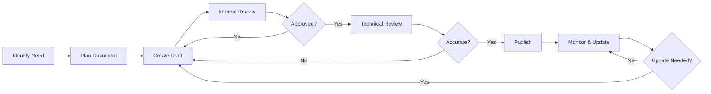
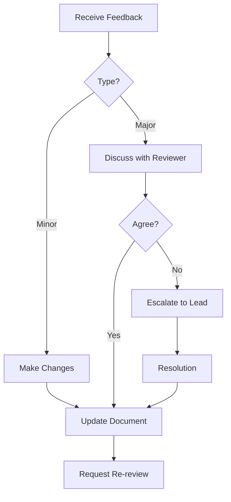

# Documentation Process Workflow Guide

> **Version:** 1.0  
> **Last Updated:** 06.07.2025  
> **Status:** Active  
> **Purpose:** Define the end-to-end process for creating, reviewing, and
> maintaining documentation

## Overview

This guide outlines the standardized workflow for all documentation in the
Estimate Service project. Following this process ensures consistency, quality,
and timely updates across all documentation.

## Documentation Lifecycle



## Phase 1: Planning

### 1.1 Identify Documentation Need

**Triggers for New Documentation:**

- 🆕 New feature or component
- 🔄 Significant changes to existing features
- 🐛 Recurring support questions
- 📊 User feedback or analytics
- 🔍 Gap analysis findings
- 📅 Scheduled reviews

### 1.2 Define Document Scope

**Document Planning Template:**

```yaml
Document Planning:
  Title: '[Proposed Title]'
  Type: '[User Guide|API Doc|Architecture|Tutorial|Reference]'
  Audience: '[Developers|End Users|Administrators|All]'
  Purpose: '[What problem does this solve?]'
  Scope:
    Included:
      - Topic 1
      - Topic 2
    Excluded:
      - Topic A
      - Topic B
  EstimatedEffort: '[Hours]'
  Owner: '[Name]'
  Reviewers: ['Name1', 'Name2']
  Deadline: 'YYYY-MM-DD'
```

### 1.3 Choose Document Type & Template

| If documenting...     | Use template...                                                                     | Location              |
| --------------------- | ----------------------------------------------------------------------------------- | --------------------- |
| New feature           | [FEATURE_DOCUMENTATION_TEMPLATE.md](../templates/FEATURE_DOCUMENTATION_TEMPLATE.md) | `/docs/features/`     |
| API endpoint          | [API_ENDPOINT_TEMPLATE.md](../templates/API_ENDPOINT_TEMPLATE.md)                   | `/docs/api/`          |
| Architecture decision | [ADR_TEMPLATE.md](../templates/ADR_TEMPLATE.md)                                     | `/docs/architecture/` |
| User process          | [USER_GUIDE_TEMPLATE.md](../templates/USER_GUIDE_TEMPLATE.md)                       | `/docs/user-guides/`  |
| Technical spec        | [TECHNICAL_SPEC_TEMPLATE.md](../templates/TECHNICAL_SPEC_TEMPLATE.md)               | `/docs/development/`  |

## Phase 2: Creation

### 2.1 Set Up Document

```bash
# 1. Create branch for documentation
git checkout -b docs/[document-name]

# 2. Copy appropriate template
cp docs/templates/[TEMPLATE].md docs/[category]/[DOCUMENT_NAME].md

# 3. Fill in metadata
# Update: Version, Date, Status, Authors
```

### 2.2 Writing Guidelines

#### Content Structure

1. **Start with Why** - Explain the purpose and value
2. **Provide Context** - Background information
3. **Be Specific** - Concrete examples and steps
4. **Stay Focused** - One topic per document
5. **Think Visual** - Diagrams, screenshots, tables

#### Writing Style

- ✅ **Active voice:** "Click the button" not "The button should be clicked"
- ✅ **Present tense:** "The system sends" not "The system will send"
- ✅ **Simple language:** Avoid unnecessary jargon
- ✅ **Consistent terms:** Use [Terminology Glossary](./TERMINOLOGY_GLOSSARY.md)
- ✅ **Clear headings:** Descriptive, not clever

### 2.3 Include Supporting Elements

#### Code Examples

```typescript
// ✅ Good: Complete, runnable example with context
import { EstimateService } from '@estimate-service/core';

const service = new EstimateService();

// Create a new estimate with error handling
try {
  const estimate = await service.create({
    name: 'Office Renovation',
    projectType: 'commercial',
    regionCode: 'MSK',
  });
  console.log(`Created estimate: ${estimate.id}`);
} catch (error) {
  console.error('Failed to create estimate:', error.message);
}
```

#### Diagrams

```mermaid
# Use Mermaid for consistency
graph TD
    A[User Input] --> B{Validate}
    B -->|Valid| C[Process]
    B -->|Invalid| D[Show Error]
    C --> E[Save to DB]
    E --> F[Return Result]
```

#### Screenshots

- Use annotation tools to highlight important areas
- Include captions explaining what the image shows
- Update screenshots when UI changes

## Phase 3: Review Process

### 3.1 Self-Review Checklist

Before submitting for review:

- [ ] Spell check completed
- [ ] Grammar check passed
- [ ] Links tested and working
- [ ] Code examples run successfully
- [ ] Screenshots are current
- [ ] Follows [Documentation Standards](./DOCUMENTATION_STANDARDS.md)
- [ ] [Consistency Checklist](./DOCUMENTATION_CONSISTENCY_CHECKLIST.md)
      completed

### 3.2 Peer Review

**Review Request Template:**

```markdown
## Documentation Review Request

**Document:** [Title with link] **Type:** [User Guide|API Doc|etc.]
**Priority:** [High|Medium|Low] **Deadline:** [Date]

**Review Focus:**

- [ ] Technical accuracy
- [ ] Completeness
- [ ] Clarity for target audience
- [ ] Code examples
- [ ] Consistency with standards

**Specific Questions:**

1. [Any specific concerns?]
2. [Areas needing particular attention?]

**Context:** [Why this documentation is needed]
```

### 3.3 Review Types

| Review Type   | Reviewer              | Focus Areas                            | Duration |
| ------------- | --------------------- | -------------------------------------- | -------- |
| **Technical** | Subject Matter Expert | Accuracy, completeness, best practices | 1-2 days |
| **Editorial** | Tech Writer or Peer   | Grammar, style, clarity, consistency   | 1 day    |
| **User**      | Target Audience Rep   | Usability, clarity, completeness       | 1 day    |
| **Final**     | Team Lead             | Overall quality, approval              | 1 day    |

### 3.4 Handling Review Feedback



## Phase 4: Publishing

### 4.1 Pre-Publishing Checklist

- [ ] All review comments addressed
- [ ] Version number updated
- [ ] Status changed to "Published"
- [ ] Related documents cross-linked
- [ ] Table of contents updated
- [ ] Search tags added (if applicable)

### 4.2 Publishing Steps

```bash
# 1. Ensure all changes committed
git add .
git commit -m "docs: Add [document name] documentation

- Covers [main topics]
- Includes [key features]
- Resolves #[issue-number]"

# 2. Push and create PR
git push origin docs/[document-name]

# 3. Create PR with template
# Title: "docs: Add [document name] documentation"
# Description: Use PR template for docs

# 4. After approval and merge
# - Update documentation index
# - Notify relevant teams
# - Close related issues
```

### 4.3 Post-Publishing

**Notification Template:**

```markdown
📚 New Documentation Published

**Title:** [Document Title] **Type:** [Document Type] **Link:** [URL]

**Summary:** [Brief description of what the document covers]

**Target Audience:** [Who should read this]

**Key Topics:**

- [Topic 1]
- [Topic 2]
- [Topic 3]

**Questions?** Contact [Document Owner]
```

## Phase 5: Maintenance

### 5.1 Update Triggers

| Trigger                    | Action Required          | Timeline        |
| -------------------------- | ------------------------ | --------------- |
| Code change affecting docs | Update relevant sections | With code PR    |
| User feedback/confusion    | Clarify or expand        | Within 1 week   |
| Monthly review             | Check accuracy           | Monthly         |
| Major release              | Full review              | Before release  |
| Broken links/images        | Fix immediately          | Within 24 hours |

### 5.2 Regular Review Schedule

```yaml
Review Schedule:
  Daily:
    - Check for broken links (automated)
    - Monitor feedback channels

  Weekly:
    - Review documentation tickets
    - Check for outdated screenshots

  Monthly:
    - Audit high-traffic documents
    - Update changelog
    - Review metrics

  Quarterly:
    - Comprehensive accuracy review
    - Update examples and versions
    - Archive obsolete documents
```

### 5.3 Version Control

**Version Numbering:**

- **Major update (1.0 → 2.0):** Complete rewrite or significant structural
  change
- **Minor update (1.0 → 1.1):** New sections or substantial content additions
- **Patch update (1.0.0 → 1.0.1):** Corrections, clarifications, minor updates

**Change Documentation:**

```markdown
## Changelog

### Version 1.1.0 - 2025-07-06

#### Added

- Section on advanced configuration
- Troubleshooting for error XYZ

#### Changed

- Updated API examples to v2
- Clarified authentication process

#### Fixed

- Corrected typo in code example
- Fixed broken link to API reference
```

## Quality Metrics

### 5.4 Documentation KPIs

| Metric           | Target                     | Measurement                | Review Frequency |
| ---------------- | -------------------------- | -------------------------- | ---------------- |
| **Coverage**     | 100% of public APIs        | Documented/Total endpoints | Monthly          |
| **Freshness**    | <30 days since last review | Average age                | Weekly           |
| **Accuracy**     | <5 reported issues/month   | User feedback              | Monthly          |
| **Findability**  | <3 clicks to any doc       | User testing               | Quarterly        |
| **Usefulness**   | >4.0/5 rating              | User surveys               | Monthly          |
| **Completeness** | 0 "TODO" items             | Automated scan             | Weekly           |

### 5.5 Feedback Collection

**Feedback Mechanisms:**

1. **In-document feedback widget**
2. **GitHub issues with `documentation` label**
3. **Slack #documentation channel**
4. **Monthly user surveys**
5. **Analytics on search terms**

## Roles & Responsibilities

### Documentation Roles Matrix

| Role                   | Responsibilities                      | Time Commitment      |
| ---------------------- | ------------------------------------- | -------------------- |
| **Document Owner**     | Create, maintain, respond to feedback | 20% for active docs  |
| **Technical Reviewer** | Verify accuracy, best practices       | 2-4 hours per review |
| **Editorial Reviewer** | Grammar, style, consistency           | 1-2 hours per review |
| **Documentation Lead** | Standards, process, metrics           | 10 hours/week        |
| **Contributors**       | Submit corrections, improvements      | As needed            |

## Tools & Resources

### Recommended Tools

| Purpose           | Tool                    | Why                          |
| ----------------- | ----------------------- | ---------------------------- |
| **Writing**       | VS Code + Markdown      | Version control, preview     |
| **Diagrams**      | Mermaid, draw.io        | Consistency, version control |
| **Screenshots**   | ShareX, Snagit          | Annotation capabilities      |
| **Grammar**       | Grammarly, LanguageTool | Catch errors                 |
| **Link Checking** | markdown-link-check     | Automation                   |
| **API Docs**      | Swagger/OpenAPI         | Auto-generation              |

### Useful Resources

1. **Templates:** `/docs/templates/`
2. **Style Guide:** [Documentation Standards](./DOCUMENTATION_STANDARDS.md)
3. **Terminology:** [Glossary](./TERMINOLOGY_GLOSSARY.md)
4. **Examples:** Look at recently updated docs
5. **Help:** Slack #documentation channel

## Common Pitfalls & How to Avoid Them

### ❌ Pitfall: Documentation as Afterthought

✅ **Solution:** Include docs in Definition of Done

### ❌ Pitfall: Too Technical for Audience

✅ **Solution:** Have target audience review drafts

### ❌ Pitfall: Outdated Information

✅ **Solution:** Automated checks + regular reviews

### ❌ Pitfall: No Clear Ownership

✅ **Solution:** Assign owner in document metadata

### ❌ Pitfall: Inconsistent Style

✅ **Solution:** Use templates + style checker

## Quick Start Checklist

For new documentation:

```markdown
- [ ] Identify documentation need
- [ ] Choose appropriate template
- [ ] Create feature branch
- [ ] Write first draft
- [ ] Complete self-review
- [ ] Submit for peer review
- [ ] Address feedback
- [ ] Get final approval
- [ ] Publish and notify
- [ ] Schedule first review
```

---

## Support

**Questions about this process?**

- 💬 Slack: #documentation
- 📧 Email: docs-team@estimate-service.com
- 📚 Wiki: [Documentation Wiki](link)

**Want to improve this process?**

- Submit a PR with your suggestions
- Discuss in #documentation channel
- Attend monthly documentation meeting

---

_This process is continuously improved based on team feedback and industry best
practices._
