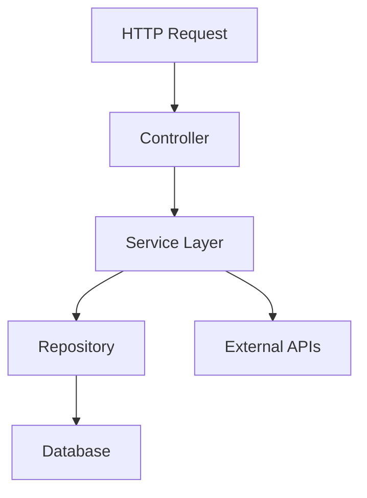

# Стандарты документации проекта Estimate Service

> **Версия:** 2.0
> **Дата обновления:** 06.07.2025
> **Статус:** Активный
> **Авторы:** Команда разработки Estimate Service

## Содержание

- [Общие принципы](#общие-принципы)
- [Структура документации](#структура-документации)
- [Типы документации](#типы-документации)
- [Инструменты документирования](#инструменты-документирования)
- [Процесс поддержки документации](#процесс-поддержки-документации)
- [Стандарты написания](#стандарты-написания)
- [Шаблоны документов](#шаблоны-документов)
- [Контроль качества](#контроль-качества)
- [Инструкции по обновлению](#инструкции-по-обновлению)

---

## Общие принципы

## Общие принципы

### 1. Принцип актуальности 📅
- Документация обновляется **синхронно** с кодом
- Устаревшая документация **хуже** отсутствующей
- Приоритет автоматической генерации где это возможно
- Обязательная ссылка на актуальную версию API

### 2. Принцип доступности 👥
- Документация понятна **целевой аудитории**
- Использование простого и ясного языка
- Структурированная подача информации
- Поддержка нескольких языков (RU/EN)

### 3. Принцип полноты 📋
- Покрытие **всех аспектов** системы
- Примеры использования для основных функций
- Обработка ошибок и граничных случаев
- Сценарии troubleshooting

### 4. Принцип последовательности 🔄
- Единообразное форматирование во всех документах
- Согласованная терминология
- Стандартная структура разделов
- Общий стиль изложения

## Структура документации

### Иерархия документов 📁

```
📁 docs/
├── 📄 README.md                          # 🏠 Главная страница проекта
├── 📄 CHANGELOG.md                       # 📈 История изменений (автоген)
├── 📄 CONTRIBUTING.md                    # 👥 Руководство для контрибьюторов
├── 📄 LICENSE                            # ⚖️ Лицензионное соглашение
│
├── 📁 architecture/                      # 🏗️ Архитектурная документация
│   ├── 📄 SYSTEM_ARCHITECTURE.md         # Общая архитектура системы
│   ├── 📄 DATABASE_SCHEMA.md             # Схема и модель данных
│   ├── 📄 API_DESIGN.md                  # Дизайн и принципы API
│   ├── 📄 SECURITY_MODEL.md              # Модель безопасности
│   ├── 📄 MICROSERVICES_OVERVIEW.md      # Обзор микросервисов
│   └── 📄 INTEGRATION_PATTERNS.md        # Паттерны интеграции
│
├── 📁 development/                       # 👨‍💻 Документация для разработчиков
│   ├── 📄 CODING_STANDARDS.md            # Стандарты кодирования
│   ├── 📄 LINTING_AND_FORMATTING.md      # Линтинг и форматирование
│   ├── 📄 TESTING_STRATEGY.md            # Стратегия тестирования
│   ├── 📄 DEPLOYMENT_GUIDE.md            # Руководство по развертыванию
│   ├── 📄 TROUBLESHOOTING.md             # Устранение неполадок
│   ├── 📄 PROJECT_STRUCTURE.md           # Структура проекта
│   └── 📄 DEVELOPMENT_WORKFLOW.md        # Рабочий процесс разработки
│
├── 📁 api/                               # 🔌 API документация
│   ├── 📄 API_REFERENCE.md               # Полный справочник API
│   ├── 📄 OPENAPI_SPEC.yaml              # OpenAPI спецификация
│   ├── 📄 AUTHENTICATION.md              # Аутентификация и авторизация
│   ├── 📄 RATE_LIMITING.md               # Ограничения запросов
│   ├── 📄 WEBHOOKS.md                    # Документация веб-хуков
│   └── 📄 CHANGELOG_API.md               # История изменений API
│
├── 📁 user-guides/                       # 📚 Руководства пользователя
│   ├── 📄 QUICK_START_GUIDE.md           # Быстрый старт
│   ├── 📄 ESTIMATE_CREATION_MANUAL.md    # Создание и управление сметами
│   ├── 📄 AI_ASSISTANT_GUIDE.md          # Работа с ИИ-ассистентом
│   ├── 📄 FSBTS_INTEGRATION.md           # Работа с базой ФСБЦ-2022
│   ├── 📄 REPORTS_AND_EXPORT.md          # Отчеты и экспорт данных
│   └── 📄 FAQ.md                         # Часто задаваемые вопросы
│
├── 📁 frontend/                          # 🎨 Frontend документация
│   ├── 📄 COMPONENT_LIBRARY.md           # Библиотека компонентов
│   ├── 📄 STATE_MANAGEMENT.md            # Управление состоянием
│   ├── 📄 ROUTING_GUIDE.md               # Маршрутизация
│   ├── 📄 UI_UX_GUIDELINES.md            # Гайдлайны UI/UX
│   └── 📄 ADVANCED_FEATURES.md           # Продвинутые возможности
│
├── 📁 deployment/                        # 🚀 Развертывание и эксплуатация
│   ├── 📄 DOCKER_GUIDE.md                # Контейнеризация
│   ├── 📄 KUBERNETES_DEPLOYMENT.md       # Развертывание в K8s
│   ├── 📄 MONITORING_AND_LOGGING.md      # Мониторинг и логирование
│   ├── 📄 BACKUP_AND_RECOVERY.md         # Резервное копирование
│   └── 📄 PERFORMANCE_TUNING.md          # Оптимизация производительности
│
└── 📁 standards/                         # 📋 Стандарты и соглашения
    ├── 📄 DOCUMENTATION_STANDARDS.md     # Стандарты документации (этот файл)
    ├── 📄 CODE_REVIEW_CHECKLIST.md       # Чек-лист для код-ревью
    ├── 📄 RELEASE_PROCESS.md             # Процесс релизов
    ├── 📄 SECURITY_GUIDELINES.md         # Руководящие принципы безопасности
    └── 📄 ARCHITECTURE_DECISIONS/        # ADR записи
        ├── 📄 ADR-001-microservices.md
        ├── 📄 ADR-002-database-choice.md
        └── 📄 ADR-003-api-versioning.md
```

### Принципы организации 🗂️

1. **Разделение по аудитории**
   - `development/` - для разработчиков
   - `user-guides/` - для конечных пользователей
   - `api/` - для интеграторов
   - `deployment/` - для DevOps

2. **Логическая группировка**
   - Связанные документы в одной папке
   - Четкое разделение Frontend/Backend
   - Отдельная категория для стандартов

3. **Соглашения по именованию**
   - UPPER_CASE для основных документов
   - kebab-case для вспомогательных файлов
   - Префиксы ADR- для Architecture Decision Records

## Типы документации

### 1. Архитектурная документация

#### Структура документа
```markdown
# Название компонента

## Обзор
Краткое описание назначения и роли компонента в системе.

## Архитектура
Диаграммы и схемы архитектуры с пояснениями.

## Интерфейсы
Описание всех внешних интерфейсов компонента.

## Зависимости
Список зависимостей и их обоснование.

## Конфигурация
Параметры конфигурации и их влияние.

## Мониторинг
Метрики, логи и способы мониторинга.

## Ограничения
Известные ограничения и их обходы.
```

#### Пример: Архитектура микросервиса
```markdown
# Estimate Service

## Обзор
Сервис отвечает за управление сметами, включая создание, редактирование, расчет стоимости и валидацию.

## Архитектура


## Интерфейсы
- REST API на порту 3001
- GraphQL endpoint на /graphql
- Webhook callbacks для уведомлений

## Зависимости
- PostgreSQL 15+ (основная БД)
- Redis 7+ (кэширование)
- FSBTS Service (справочные данные)
- AI Assistant Service (рекомендации)
```

### 2. API документация

#### OpenAPI спецификация
```yaml
openapi: 3.0.3
info:
  title: Estimate Service API
  description: API для управления сметами
  version: 1.0.0
  contact:
    name: Development Team
    email: dev@example.com

servers:
  - url: https://api.estimate-service.com/v1
    description: Production server
  - url: https://staging-api.estimate-service.com/v1
    description: Staging server

paths:
  /estimates:
    get:
      summary: Получить список смет
      description: |
        Возвращает пагинированный список смет пользователя.

        Поддерживает фильтрацию по статусу, дате создания и типу проекта.
      parameters:
        - name: page
          in: query
          schema:
            type: integer
            default: 1
          description: Номер страницы
        - name: limit
          in: query
          schema:
            type: integer
            default: 20
            maximum: 100
          description: Количество элементов на странице
      responses:
        '200':
          description: Список смет
          content:
            application/json:
              schema:
                $ref: '#/components/schemas/EstimateList'
              example:
                items:
                  - id: "123e4567-e89b-12d3-a456-426614174000"
                    name: "Строительство дома"
                    status: "draft"
                    total_cost: 5000000
                pagination:
                  page: 1
                  limit: 20
                  total: 50
                  pages: 3
```

#### JSDoc для TypeScript
```typescript
/**
 * Сервис для работы со сметами
 *
 * Предоставляет методы для создания, редактирования и расчета смет.
 * Интегрируется с базой данных ФСБЦ-2022 и ИИ-ассистентом.
 *
 * @example
 * ```typescript
 * const estimateService = new EstimateService(prisma, logger);
 * const estimate = await estimateService.create({
 *   name: 'Новая смета',
 *   projectType: ProjectType.RESIDENTIAL
 * });
 * ```
 */
export class EstimateService {
  /**
   * Создает новую смету
   *
   * @param data - Данные для создания сметы
   * @param data.name - Название сметы (1-255 символов)
   * @param data.description - Описание сметы (опционально)
   * @param data.projectType - Тип проекта
   * @param data.regionCode - Код региона для применения коэффициентов
   *
   * @returns Созданная смета с присвоенным ID
   *
   * @throws {ValidationError} Если переданы некорректные данные
   * @throws {DatabaseError} При ошибке сохранения в БД
   *
   * @example
   * ```typescript
   * const estimate = await service.create({
   *   name: 'Смета на дом',
   *   projectType: ProjectType.RESIDENTIAL,
   *   regionCode: 'MSK'
   * });
   * console.log(`Создана смета с ID: ${estimate.id}`);
   * ```
   */
  async create(data: CreateEstimateDto): Promise<Estimate> {
    // Реализация...
  }

  /**
   * Рассчитывает общую стоимость сметы
   *
   * Учитывает:
   * - Базовые цены по ФСБЦ-2022
   * - Региональные коэффициенты
   * - Накладные расходы
   * - НДС
   *
   * @param estimateId - ID сметы для расчета
   * @param options - Дополнительные параметры расчета
   * @param options.includeVAT - Включать ли НДС в расчет (по умолчанию true)
   * @param options.overheadRate - Процент накладных расходов (по умолчанию 15%)
   *
   * @returns Детализированный расчет стоимости
   *
   * @throws {NotFoundError} Если смета не найдена
   * @throws {CalculationError} При ошибке расчета
   */
  async calculateCost(
    estimateId: string,
    options: CalculationOptions = {}
  ): Promise<EstimateCost> {
    // Реализация...
  }
}
```

### 3. Пользовательская документация

#### Структура руководства пользователя
```markdown
# Название функции

## Обзор
Краткое описание что делает функция и зачем она нужна.

## Предварительные требования
Что нужно знать или сделать перед использованием.

## Пошаговая инструкция
Детальные шаги с скриншотами.

## Примеры использования
Реальные сценарии применения.

## Часто встречающиеся ошибки
Типичные проблемы и их решения.

## Дополнительные ресурсы
Ссылки на связанную документацию.
```

#### Пример: Создание сметы
```markdown
# Создание новой сметы

## Обзор
Функция создания сметы позволяет пользователям создавать детальные расчеты стоимости строительных проектов на основе базы ФСБЦ-2022.

## Предварительные требования
- Активная учетная запись в системе
- Роль "Сметчик" или выше
- Базовые знания о строительных работах

## Пошаговая инструкция

### Шаг 1: Открытие формы создания
1. Войдите в систему
2. Перейдите в раздел "Сметы"
3. Нажмите кнопку "Создать смету"


### Шаг 2: Заполнение основной информации
1. Введите название сметы
2. Выберите тип проекта из выпадающего списка
3. Укажите регион строительства
4. Добавьте описание (опционально)

### Шаг 3: Добавление позиций
1. Нажмите "Добавить позицию"
2. Воспользуйтесь поиском по базе ФСБЦ-2022
3. Укажите количество и единицы измерения
4. Проверьте автоматически рассчитанную стоимость

## Примеры использования

### Смета на строительство дома
```json
{
  "name": "Строительство частного дома 150 м²",
  "projectType": "RESIDENTIAL",
  "regionCode": "MSK",
  "items": [
    {
      "fsbtsCode": "01.01.001",
      "name": "Разработка грунта экскаватором",
      "quantity": 200,
      "unit": "м³"
    }
  ]
}
```

## Часто встречающиеся ошибки

### Ошибка: "Некорректный код ФСБЦ"
**Причина:** Введен несуществующий или устаревший код расценки.
**Решение:** Воспользуйтесь поиском по базе или обратитесь к справочнику.

### Ошибка: "Превышен лимит позиций"
**Причина:** В смете больше 1000 позиций.
**Решение:** Разбейте смету на несколько частей или используйте укрупненные позиции.
```

### 4. Техническая документация

#### ADR (Architecture Decision Records)
```markdown
# ADR-001: Выбор архитектурного паттерна для микросервисов

## Статус
Принято

## Контекст
Необходимо выбрать архитектурный паттерн для организации микросервисов в системе составления смет.

## Рассмотренные варианты
1. Monolithic architecture
2. Service-oriented architecture (SOA)
3. Microservices with API Gateway
4. Event-driven architecture

## Принятое решение
Микросервисная архитектура с API Gateway и event-driven коммуникацией.

## Обоснование
- Независимая разработка и развертывание сервисов
- Лучшая масштабируемость
- Возможность использования разных технологий
- Отказоустойчивость

## Последствия
### Положительные
- Независимые команды разработки
- Технологическое разнообразие
- Лучшая отказоустойчивость

### Отрицательные
- Сложность развертывания
- Необходимость в распределенном мониторинге
- Сетевые задержки

## Дата принятия
2024-07-04

## Авторы
- Архитектор проекта
- Техническое руководство
```

## Инструменты документирования

### 1. Автогенерация API документации

#### Swagger/OpenAPI
```typescript
import { ApiProperty, ApiTags, ApiResponse } from '@nestjs/swagger';

@ApiTags('estimates')
export class CreateEstimateDto {
  @ApiProperty({
    description: 'Название сметы',
    example: 'Строительство дома',
    minLength: 1,
    maxLength: 255
  })
  name: string;

  @ApiProperty({
    description: 'Тип проекта',
    enum: ProjectType,
    example: ProjectType.RESIDENTIAL
  })
  projectType: ProjectType;
}

@Controller('estimates')
export class EstimateController {
  @Post()
  @ApiResponse({
    status: 201,
    description: 'Смета успешно создана',
    type: Estimate
  })
  @ApiResponse({
    status: 400,
    description: 'Некорректные данные'
  })
  async create(@Body() dto: CreateEstimateDto): Promise<Estimate> {
    // Реализация...
  }
}
```

### 2. Документация схемы БД

#### Prisma Schema комментарии
```prisma
/// Основная таблица смет
model Estimate {
  /// Уникальный идентификатор сметы
  id          String   @id @default(uuid())

  /// Название сметы (обязательное поле)
  name        String   @db.VarChar(255)

  /// Подробное описание проекта
  description String?  @db.Text

  /// Тип проекта (жилой, коммерческий, промышленный)
  projectType ProjectType

  /// Код региона для применения коэффициентов
  regionCode  String   @db.VarChar(10)

  /// Общая стоимость сметы в рублях
  totalCost   Decimal  @db.Decimal(15, 2)

  /// Статус сметы
  status      EstimateStatus @default(DRAFT)

  /// Дата создания записи
  createdAt   DateTime @default(now())

  /// Дата последнего обновления
  updatedAt   DateTime @updatedAt

  /// Позиции сметы
  items       EstimateItem[]

  /// Пользователь, создавший смету
  user        User     @relation(fields: [userId], references: [id])
  userId      String

  @@map("estimates")
}

/// Статусы сметы
enum EstimateStatus {
  DRAFT     /// Черновик
  REVIEW    /// На проверке
  APPROVED  /// Утверждена
  REJECTED  /// Отклонена
  ARCHIVED  /// Архивирована

  @@map("estimate_status")
}
```

### 3. Интерактивная документация

#### Docusaurus конфигурация
```javascript
// docusaurus.config.js
module.exports = {
  title: 'Estimate Service Documentation',
  tagline: 'Система составления сметной документации',
  url: 'https://docs.estimate-service.com',
  baseUrl: '/',

  presets: [
    [
      '@docusaurus/preset-classic',
      {
        docs: {
          sidebarPath: require.resolve('./sidebars.js'),
          editUrl: 'https://github.com/company/estimate-service/edit/main/docs/',
        },
        theme: {
          customCss: require.resolve('./src/css/custom.css'),
        },
      },
    ],
  ],

  plugins: [
    [
      'docusaurus-plugin-openapi-docs',
      {
        id: "apiDocs",
        docsPluginId: "classic",
        config: {
          estimate: {
            specPath: "api/estimate-service.yaml",
            outputDir: "docs/api",
            sidebarOptions: {
              groupPathsBy: "tag",
            },
          },
        }
      },
    ],
  ],
};
```

## Процесс поддержки документации

### 1. Definition of Done для документации
- [ ] API endpoints задокументированы в OpenAPI
- [ ] Изменения в архитектуре отражены в ADR
- [ ] Обновлены пользовательские руководства
- [ ] Добавлены примеры использования
- [ ] Проверена орфография и грамматика
- [ ] Документация прошла техническое редактирование

### 2. Регулярный аудит документации
```yaml
# .github/workflows/docs-audit.yml
name: Documentation Audit

on:
  schedule:
    - cron: '0 0 * * 1' # Каждый понедельник

jobs:
  audit:
    runs-on: ubuntu-latest
    steps:
      - uses: actions/checkout@v3

      - name: Check for outdated docs
        run: |
          # Проверка ссылок
          npm run docs:check-links

          # Проверка актуальности API документации
          npm run docs:validate-api

          # Проверка соответствия кода и документации
          npm run docs:sync-check

      - name: Create issue if docs are outdated
        if: failure()
        uses: actions/github-script@v6
        with:
          script: |
            github.rest.issues.create({
              owner: context.repo.owner,
              repo: context.repo.repo,
              title: 'Обнаружена устаревшая документация',
              body: 'Автоматическая проверка выявила несоответствия в документации.',
              labels: ['documentation', 'maintenance']
            });
```

### 3. Метрики качества документации
- Покрытие API endpoints документацией (цель: 100%)
- Актуальность документации (проверка раз в неделю)
- Количество обращений в поддержку по вопросам документации
- Время отклика на запросы об обновлении документации

## Стандарты написания

### 1. Язык и стиль
- Русский язык для пользовательской документации
- Английский язык для технической документации и комментариев в коде
- Простые и понятные предложения
- Активный залог
- Настоящее время

### 2. Форматирование
- Заголовки по иерархии (H1 -> H2 -> H3)
- Нумерованные списки для последовательных действий
- Маркированные списки для перечислений
- Блоки кода с указанием языка
- Выделение важной информации

### 3. Структура документа
```markdown
# Заголовок документа

## Краткое описание
Одно-два предложения о назначении документа.

## Содержание
- [Раздел 1](#раздел-1)
- [Раздел 2](#раздел-2)

## Раздел 1
Содержание раздела...

## Заключение
Резюме и следующие шаги.

## Дополнительные ресурсы
- [Ссылка 1](url)
- [Ссылка 2](url)

---
*Документ обновлен: 06.07.2025*
*Версия: 2.0*
*Авторы: Команда разработки Estimate Service*
*Статус: Активный*

## Шаблоны документов

### Шаблон технического документа
```markdown
# [Название документа]

> **Версия:** X.Y
> **Дата:** ДД.ММ.ГГГГ
> **Статус:** [Черновик|Активный|Устаревший]
> **Авторы:** [Имена авторов]

## Аннотация
Краткое описание (2-3 предложения) о содержании и назначении документа.

## Содержание
- [Раздел 1](#раздел-1)
- [Раздел 2](#раздел-2)

## Введение
Подробное описание контекста и целей документа.

## [Основные разделы]
...

## Заключение
Выводы и следующие шаги.

## Дополнительные ресурсы
- [Ссылка 1](url)
- [Ссылка 2](url)

---
*Последнее обновление: [дата]*
```

### Шаблон API документации
```markdown
# API Endpoint: [Method] [Path]

## Описание
Что делает этот endpoint.

## Аутентификация
Требования к аутентификации.

## Параметры запроса
| Параметр | Тип | Обязательный | Описание |
|----------|-----|-------------|----------|
| param1   | string | Да | Описание |

## Пример запроса
```http
POST /api/v1/resource
Content-Type: application/json

{
  "field": "value"
}
```

## Пример ответа
```json
{
  "success": true,
  "data": {}
}
```

## Коды ошибок
| Код | Описание |
|-----|----------|
| 400 | Bad Request |
| 401 | Unauthorized |
```

### Шаблон пользовательского руководства
```markdown
# [Название функции/процесса]

## Обзор
Краткое описание возможности и ее пользы.

## Что вам понадобится
- Требование 1
- Требование 2

## Пошаговая инструкция

### Шаг 1: [Название шага]
1. Действие 1
2. Действие 2

[Скриншот при необходимости]

### Шаг 2: [Название шага]
...

## Примеры использования
Реальные сценарии применения.

## Устранение неполадок
| Проблема | Решение |
|----------|---------|
| Ошибка X | Действие Y |

## Дополнительная информация
Ссылки на связанную документацию.
```

## Контроль качества

### Чек-лист качества документации ✅

#### Содержание
- [ ] **Актуальность:** Информация соответствует текущей версии системы
- [ ] **Полнота:** Покрыты все основные сценарии использования
- [ ] **Точность:** Техническая информация проверена и корректна
- [ ] **Примеры:** Включены работающие примеры кода/конфигурации

#### Структура и форматирование
- [ ] **Заголовки:** Логичная иерархия заголовков (H1 → H2 → H3)
- [ ] **Оглавление:** Присутствует для документов >500 слов
- [ ] **Код:** Блоки кода имеют указание языка
- [ ] **Ссылки:** Все ссылки работают и актуальны

#### Языковое качество
- [ ] **Ясность:** Простой и понятный язык
- [ ] **Грамматика:** Отсутствие орфографических и грамматических ошибок
- [ ] **Терминология:** Согласованная терминология во всем документе
- [ ] **Аудитория:** Соответствие языка целевой аудитории

#### Техническое качество
- [ ] **Примеры:** Все примеры кода протестированы
- [ ] **Скриншоты:** Актуальные изображения UI
- [ ] **Версии:** Указаны версии используемых инструментов
- [ ] **Интеграция:** Документация интегрирована в общую систему

### Автоматизированная проверка

#### GitHub Actions для проверки документации
```yaml
# .github/workflows/docs-quality.yml
name: 📚 Documentation Quality Check

on:
  pull_request:
    paths:
      - 'docs/**'
      - '**/*.md'
  push:
    branches: [main, develop]

jobs:
  markdown-lint:
    name: 🔍 Markdown Linting
    runs-on: ubuntu-latest
    steps:
      - uses: actions/checkout@v4

      - name: Lint Markdown files
        uses: articulate/actions-markdownlint@v1
        with:
          config: .markdownlint.json
          files: 'docs/**/*.md'

  link-check:
    name: 🔗 Link Validation
    runs-on: ubuntu-latest
    steps:
      - uses: actions/checkout@v4

      - name: Check links
        uses: gaurav-nelson/github-action-markdown-link-check@v1
        with:
          use-quiet-mode: 'yes'
          use-verbose-mode: 'yes'
          config-file: '.markdown-link-check.json'

  spell-check:
    name: 📝 Spell Check
    runs-on: ubuntu-latest
    steps:
      - uses: actions/checkout@v4

      - name: Spell Check
        uses: streetsidesoftware/cspell-action@v2
        with:
          files: 'docs/**/*.md'
          config: '.cspell.json'

  api-docs-sync:
    name: 🔄 API Docs Sync Check
    runs-on: ubuntu-latest
    steps:
      - uses: actions/checkout@v4

      - name: Setup Node.js
        uses: actions/setup-node@v4
        with:
          node-version: '20'

      - name: Install dependencies
        run: npm ci

      - name: Generate API docs
        run: npm run docs:generate-api

      - name: Check for changes
        run: |
          if ! git diff --quiet docs/api/; then
            echo "❌ API documentation is out of sync!"
            echo "Run 'npm run docs:generate-api' to update."
            exit 1
          fi
```

#### Конфигурация инструментов

**.markdownlint.json**
```json
{
  "MD013": false,
  "MD033": {
    "allowed_elements": ["br", "sub", "sup", "kbd", "img"]
  },
  "MD041": false
}
```

**.cspell.json**
```json
{
  "version": "0.2",
  "language": "en,ru",
  "dictionaries": [
    "typescript",
    "node",
    "software-terms",
    "custom-terms"
  ],
  "dictionaryDefinitions": [
    {
      "name": "custom-terms",
      "path": "./docs/.cspell/custom-dictionary.txt"
    }
  ],
  "ignorePaths": [
    "node_modules/**",
    "dist/**",
    "*.min.js"
  ]
}
```

## Инструкции по обновлению

### Процесс обновления документации 🔄

#### 1. Планирование обновлений


#### 2. Роли и ответственность

| Роль | Ответственность |
|------|----------------|
| **Разработчик** | Обновление технической документации, комментариев в коде |
| **Tech Writer** | Обновление пользовательской документации, стиль и структура |
| **Product Manager** | Валидация пользовательских сценариев, приоритизация |
| **QA Engineer** | Проверка примеров, тестирование инструкций |
| **DevOps** | Документация по развертыванию, мониторингу |

#### 3. Временные рамки
- **Критические изменения:** В том же PR
- **Значительные изменения:** В течение 2 рабочих дней
- **Второстепенные изменения:** В течение 1 недели
- **Регулярный аудит:** Ежемесячно

#### 4. Уведомления об изменениях
```yaml
# .github/workflows/docs-changelog.yml
name: 📋 Documentation Changelog

on:
  push:
    branches: [main]
    paths: ['docs/**']

jobs:
  notify:
    runs-on: ubuntu-latest
    steps:
      - name: Notify Slack
        uses: 8398a7/action-slack@v3
        with:
          status: custom
          custom_payload: |
            {
              text: "📚 Документация обновлена",
              attachments: [{
                color: "good",
                fields: [{
                  title: "Изменения",
                  value: "${{ github.event.head_commit.message }}",
                  short: true
                }]
              }]
            }
        env:
          SLACK_WEBHOOK_URL: ${{ secrets.SLACK_WEBHOOK_URL }}
```

### Метрики качества документации 📊

#### KPI документации
1. **Покрытие API:** Процент задокументированных endpoints
2. **Актуальность:** Время с момента изменения кода до обновления документации
3. **Использование:** Просмотры страниц документации
4. **Обратная связь:** Оценки полезности от пользователей
5. **Поддержка:** Количество тикетов по документации

#### Dashboard метрик
```javascript
// scripts/docs-metrics.js
const metrics = {
  apiCoverage: calculateAPICoverage(),
  outdatedDocs: findOutdatedDocs(),
  pageViews: getAnalyticsData(),
  userFeedback: collectFeedbackScores(),
  supportTickets: countDocumentationTickets()
};

console.table(metrics);
```

---

## Заключение

Качественная документация — это инвестиция в будущее проекта. Следование данным стандартам обеспечивает:

- ✅ **Снижение onboarding времени** для новых разработчиков
- ✅ **Уменьшение количества** вопросов в поддержке
- ✅ **Повышение качества** интеграций с API
- ✅ **Улучшение maintainability** проекта
- ✅ **Профессиональный имидж** продукта

### Следующие шаги
1. Проведите аудит существующей документации
2. Настройте автоматизированные проверки
3. Обучите команду стандартам
4. Внедрите процесс регулярных обновлений

### Полезные ресурсы
- [Markdown Guide](https://www.markdownguide.org/)
- [OpenAPI Specification](https://swagger.io/specification/)
- [Mermaid Diagramming](https://mermaid-js.github.io/mermaid/)
- [Docusaurus Documentation](https://docusaurus.io/)

---
*Документ обновлен: 06.07.2025*
*Версия: 2.0*
*Авторы: Команда разработки Estimate Service*
*Статус: Активный*
```
