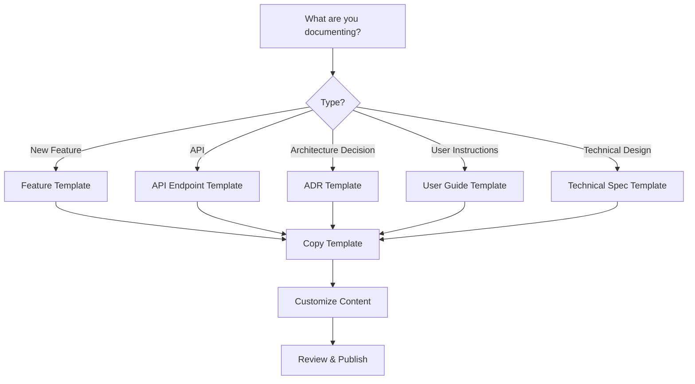

# Documentation Templates Usage Guide

> **Version:** 1.0  
> **Last Updated:** 06.07.2025  
> **Purpose:** Guide for effectively using documentation templates

## Overview

This guide helps you choose and use the right documentation template for your
needs. Templates ensure consistency, save time, and help maintain quality across
all project documentation.

## Available Templates

### 1. Feature Documentation Template

**File:**
[`FEATURE_DOCUMENTATION_TEMPLATE.md`](../templates/FEATURE_DOCUMENTATION_TEMPLATE.md)  
**When
to use:** Documenting new features or major functionality

**Best for:**

- New module implementations
- Major feature additions
- Complex functionality requiring multiple perspectives
- Features spanning multiple components

**Key sections:**

- Executive Summary
- Technical Specification
- User Guide
- API Documentation
- Testing Strategy

**Example use cases:**

- AI Assistant integration
- Payment processing system
- Report generation feature
- User authentication system

### 2. API Endpoint Template

**File:** [`API_ENDPOINT_TEMPLATE.md`](../templates/API_ENDPOINT_TEMPLATE.md)  
**When to use:** Documenting individual API endpoints or API collections

**Best for:**

- REST API endpoints
- GraphQL queries/mutations
- WebSocket events
- Third-party API integrations

**Key sections:**

- Authentication requirements
- Request/Response schemas
- Error handling
- Rate limiting
- Code examples

**Example use cases:**

- `/api/v1/estimates` endpoints
- Authentication endpoints
- Webhook endpoints
- Integration APIs

### 3. Architecture Decision Record (ADR)

**File:** [`ADR_TEMPLATE.md`](../templates/ADR_TEMPLATE.md)  
**When to use:** Recording significant architectural decisions

**Best for:**

- Technology choices
- Architectural patterns
- Major refactoring decisions
- Integration strategies

**Key sections:**

- Context and problem statement
- Considered options
- Decision outcome
- Consequences
- Implementation details

**Example use cases:**

- Choosing between REST and GraphQL
- Database technology selection
- Microservices vs monolith
- Authentication strategy

### 4. User Guide Template

**File:** [`USER_GUIDE_TEMPLATE.md`](../templates/USER_GUIDE_TEMPLATE.md)  
**When to use:** Creating end-user documentation

**Best for:**

- Step-by-step tutorials
- Feature walkthroughs
- Administrative guides
- Getting started guides

**Key sections:**

- Prerequisites
- Step-by-step instructions
- Screenshots and visuals
- Troubleshooting
- FAQ

**Example use cases:**

- How to create an estimate
- Admin panel guide
- Report generation tutorial
- Mobile app user guide

### 5. Technical Specification Template

**File:**
[`TECHNICAL_SPEC_TEMPLATE.md`](../templates/TECHNICAL_SPEC_TEMPLATE.md)  
**When to use:** Detailed technical planning and design

**Best for:**

- System design documents
- Database schemas
- Integration specifications
- Performance requirements

**Key sections:**

- System architecture
- Data models
- Security design
- Infrastructure requirements
- Testing strategy

**Example use cases:**

- Microservices architecture spec
- Database design document
- Security implementation plan
- Performance optimization spec

## How to Use Templates

### Step 1: Choose the Right Template



### Step 2: Copy the Template

```bash
# Navigate to your documentation directory
cd docs/[appropriate-category]/

# Copy the template
cp ../templates/[TEMPLATE_NAME].md ./[YOUR_DOCUMENT_NAME].md

# Example:
cp ../templates/FEATURE_DOCUMENTATION_TEMPLATE.md ./AI_ASSISTANT_FEATURE.md
```

### Step 3: Fill in the Template

#### 3.1 Start with Metadata

```markdown
> **Document Version:** 1.0  
> **Last Updated:** 2025-07-06  
> **Status:** Draft  
> **Author(s):** John Doe, Jane Smith  
> **Reviewers:** Tech Lead, Product Manager
```

#### 3.2 Replace Placeholders

- Look for `{placeholder}` text
- Replace with actual content
- Remove sections that don't apply
- Add sections if needed

#### 3.3 Follow Section Guidelines

**DO:**

- Keep original section structure
- Maintain heading hierarchy
- Use provided formatting
- Include all required sections

**DON'T:**

- Skip required sections
- Change heading levels
- Remove helpful comments
- Alter template structure significantly

### Step 4: Customize for Your Needs

#### Adding Sections

```markdown
## Custom Section Name

### Subsection

Your content here...

### Another Subsection

More content...
```

#### Removing Sections

- Only remove sections marked as optional
- Keep core sections for consistency
- Document why sections were removed

#### Modifying Examples

```markdown
# Original template example:

{Example: User authentication flow}

# Your customized version:

The estimate creation flow works as follows:

1. User clicks "New Estimate"
2. System validates permissions
3. Form is displayed
4. User fills required fields
5. System saves estimate
```

## Template Best Practices

### 1. Don't Over-Template

- Templates are guides, not rigid rules
- Adapt to your specific needs
- Keep the spirit of consistency

### 2. Maintain Template Integrity

- Keep core structure intact
- Don't remove key sections
- Preserve formatting standards

### 3. Use Real Examples

```markdown
# ❌ Bad: Generic example

POST /api/v1/{resource} { "field": "value" }

# ✅ Good: Specific example

POST /api/v1/estimates { "name": "Office Renovation", "projectType":
"commercial", "regionCode": "MSK", "items": [ { "description": "Demolition
work", "quantity": 100, "unit": "m2", "rate": 500 } ] }
```

### 4. Complete All Required Fields

**Required in All Templates:**

- Document metadata (version, date, author)
- Table of contents (for docs >500 words)
- Introduction/Overview
- Main content sections
- References/Related documents

### 5. Review Before Publishing

Use this checklist:

- [ ] All placeholders replaced
- [ ] Examples are relevant
- [ ] Links are working
- [ ] Code snippets tested
- [ ] Formatting consistent
- [ ] Spelling/grammar checked

## Common Mistakes to Avoid

### 1. Leaving Placeholders

```markdown
# ❌ Bad: Forgot to replace

This feature allows {users} to {action}.

# ✅ Good: Properly filled

This feature allows authenticated users to create and manage construction
estimates.
```

### 2. Skipping Important Sections

```markdown
# ❌ Bad: Skipped security section

(Security considerations removed)

# ✅ Good: Addressed even if minimal

## Security Considerations

This endpoint requires authentication via JWT token. No special security
measures needed beyond standard auth.
```

### 3. Inconsistent Formatting

```markdown
# ❌ Bad: Mixed styles

## SECTION ONE

### Sub-Section

#### sub-sub-section

# ✅ Good: Consistent style

## Section One

### Sub-Section

#### Sub-Sub-Section
```

### 4. Generic Examples

```markdown
# ❌ Bad: Too generic

The system processes the data and returns results.

# ✅ Good: Specific and helpful

The estimate service validates the input data against FSBC-2022 rates, applies
regional coefficients, calculates totals including VAT, and returns a detailed
breakdown with subtotals for each category.
```

## Template Maintenance

### Suggesting Template Improvements

1. **Identify the issue**
   - Missing section
   - Unclear instruction
   - Better example needed

2. **Propose solution**

   ```markdown
   ## Suggested Addition: Performance Benchmarks Section

   ### Why needed:

   Many features need performance documentation

   ### Proposed section:

   ## Performance Benchmarks

   - Target metrics
   - Test methodology
   - Results
   - Optimization tips
   ```

3. **Submit proposal**
   - Create GitHub issue
   - Tag documentation team
   - Provide examples

### Template Version Control

- Templates are versioned
- Changes tracked in git
- Major changes announced
- Backward compatibility maintained

## Quick Reference

### Template Selection Matrix

| If you need to document...         | Use this template...      |
| ---------------------------------- | ------------------------- |
| How a feature works for developers | Feature Documentation     |
| How to use a feature as end-user   | User Guide                |
| API endpoint details               | API Endpoint              |
| Why we chose a technology          | ADR                       |
| System design details              | Technical Spec            |
| Database schema                    | Technical Spec            |
| Integration guide                  | Feature or Technical Spec |
| Troubleshooting guide              | User Guide                |
| Architecture overview              | Technical Spec or ADR     |

### Quick Commands

```bash
# List all templates
ls docs/templates/

# View template
cat docs/templates/TEMPLATE_NAME.md

# Copy template
cp docs/templates/TEMPLATE_NAME.md docs/category/MY_DOC.md

# Search templates
grep -r "keyword" docs/templates/
```

## Getting Help

### Resources

- **Templates location:** `/docs/templates/`
- **Standards guide:** [Documentation Standards](./DOCUMENTATION_STANDARDS.md)
- **Process guide:**
  [Documentation Workflow](./DOCUMENTATION_PROCESS_WORKFLOW.md)
- **Terminology:** [Glossary](./TERMINOLOGY_GLOSSARY.md)

### Support Channels

- 💬 Slack: #documentation
- 📧 Email: docs-team@estimate-service.com
- 🐛 Issues: GitHub issues with `documentation` label

---

**Remember:** Templates are here to help, not hinder. Use them as a starting
point and adapt as needed while maintaining consistency across the project.
