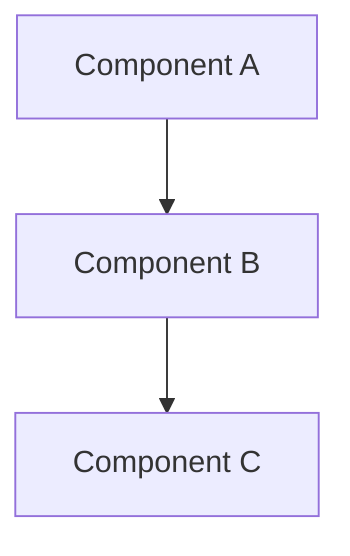

# Architecture Decision Record (ADR) Template

> **ADR Number:** ADR-{XXX}  
> **Title:** {Short descriptive title}  
> **Date:** {YYYY-MM-DD}  
> **Status:** {Proposed|Accepted|Rejected|Deprecated|Superseded}  
> **Authors:** {Author names}  
> **Deciders:** {Names of people who approved this decision}  
> **Technical Story:** {Link to relevant ticket/issue}

## Summary

### Issue

{1-2 sentences describing the problem or question this ADR addresses}

### Decision

{1-2 sentences stating what was decided}

### Status

{Current status - Proposed, Accepted, Rejected, Deprecated, or Superseded by
ADR-XXX}

---

## Context and Problem Statement

{Describe the context and problem statement in detail. Include:

- Background information
- Why this decision is needed now
- What happens if we don't make this decision
- Key requirements and constraints
- Success criteria}

### Requirements

- **Functional Requirements:**
  - {Requirement 1}
  - {Requirement 2}

- **Non-Functional Requirements:**
  - {Performance requirement}
  - {Security requirement}
  - {Scalability requirement}

### Constraints

- {Technical constraint}
- {Business constraint}
- {Time constraint}

---

## Decision Drivers

1. **{Driver 1}** - {Explanation of why this is important}
2. **{Driver 2}** - {Explanation of why this is important}
3. **{Driver 3}** - {Explanation of why this is important}

---

## Considered Options

### Option 1: {Option Name}

**Description:** {Detailed description of this option}

**Pros:**

- ✅ {Advantage 1}
- ✅ {Advantage 2}
- ✅ {Advantage 3}

**Cons:**

- ❌ {Disadvantage 1}
- ❌ {Disadvantage 2}
- ❌ {Disadvantage 3}

**Estimated Effort:** {Low|Medium|High} **Risk Level:** {Low|Medium|High}

### Option 2: {Option Name}

**Description:** {Detailed description of this option}

**Pros:**

- ✅ {Advantage 1}
- ✅ {Advantage 2}

**Cons:**

- ❌ {Disadvantage 1}
- ❌ {Disadvantage 2}

**Estimated Effort:** {Low|Medium|High} **Risk Level:** {Low|Medium|High}

### Option 3: {Option Name}

**Description:** {Detailed description of this option}

**Pros:**

- ✅ {Advantage 1}
- ✅ {Advantage 2}

**Cons:**

- ❌ {Disadvantage 1}
- ❌ {Disadvantage 2}

**Estimated Effort:** {Low|Medium|High} **Risk Level:** {Low|Medium|High}

---

## Decision Outcome

### Chosen Option

**Option {X}: {Option Name}**

### Rationale

{Explain why this option was chosen, referencing the decision drivers and how
this option best addresses them}

### Implementation Approach

1. {Step 1}
2. {Step 2}
3. {Step 3}

### Expected Outcomes

- {Outcome 1}
- {Outcome 2}
- {Outcome 3}

---

## Consequences

### Positive Consequences

- ✅ **{Benefit 1}** - {Detailed explanation}
- ✅ **{Benefit 2}** - {Detailed explanation}
- ✅ **{Benefit 3}** - {Detailed explanation}

### Negative Consequences

- ⚠️ **{Risk/Cost 1}** - {Detailed explanation and mitigation strategy}
- ⚠️ **{Risk/Cost 2}** - {Detailed explanation and mitigation strategy}

### Technical Debt

{Describe any technical debt this decision might introduce and plan to address
it}

---

## Implementation Details

### Architecture Diagram



### Code Example

```typescript
// Example implementation
interface {InterfaceName} {
  // Define interface
}

class {ClassName} implements {InterfaceName} {
  // Implementation
}
```

### Migration Strategy

{If applicable, describe how to migrate from current state to new state}

1. **Phase 1:** {Description}
2. **Phase 2:** {Description}
3. **Phase 3:** {Description}

---

## Validation

### How to Validate This Decision

1. **Metric 1:** {What to measure and expected value}
2. **Metric 2:** {What to measure and expected value}
3. **Metric 3:** {What to measure and expected value}

### Rollback Plan

{Describe how to rollback this decision if needed}

---

## References

### Internal References

- [{Document/ADR name}](link) - {Brief description}
- [{Document/ADR name}](link) - {Brief description}

### External References

- [{Article/Paper title}](link) - {Brief description}
- [{Technology documentation}](link) - {Brief description}

### Related ADRs

- **Depends on:** ADR-{XXX} - {Title}
- **Related to:** ADR-{XXX} - {Title}
- **Supersedes:** ADR-{XXX} - {Title}
- **Superseded by:** ADR-{XXX} - {Title}

---

## Notes

### Open Questions

- [ ] {Question 1}
- [ ] {Question 2}

### Future Considerations

{Things to consider for future iterations or decisions}

### Assumptions

- {Assumption 1}
- {Assumption 2}

---

## Review and Approval

### Review Comments

| Reviewer | Date   | Comments   |
| -------- | ------ | ---------- |
| {Name}   | {Date} | {Comments} |

### Approval

| Role          | Name   | Date   | Decision            |
| ------------- | ------ | ------ | ------------------- |
| Tech Lead     | {Name} | {Date} | {Approved/Rejected} |
| Architect     | {Name} | {Date} | {Approved/Rejected} |
| Product Owner | {Name} | {Date} | {Approved/Rejected} |

---

## Changelog

| Version   | Date   | Author   | Changes          |
| --------- | ------ | -------- | ---------------- |
| 1.0       | {Date} | {Author} | Initial proposal |
| {Version} | {Date} | {Author} | {Changes made}   |
