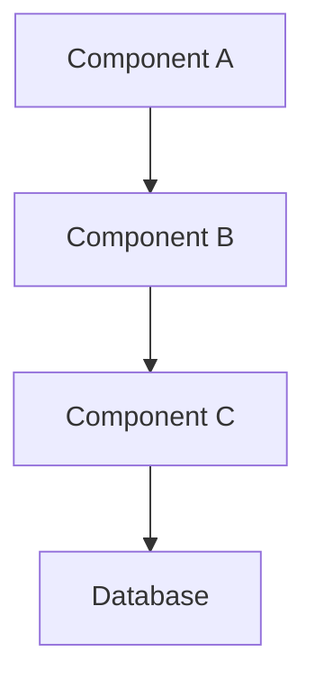
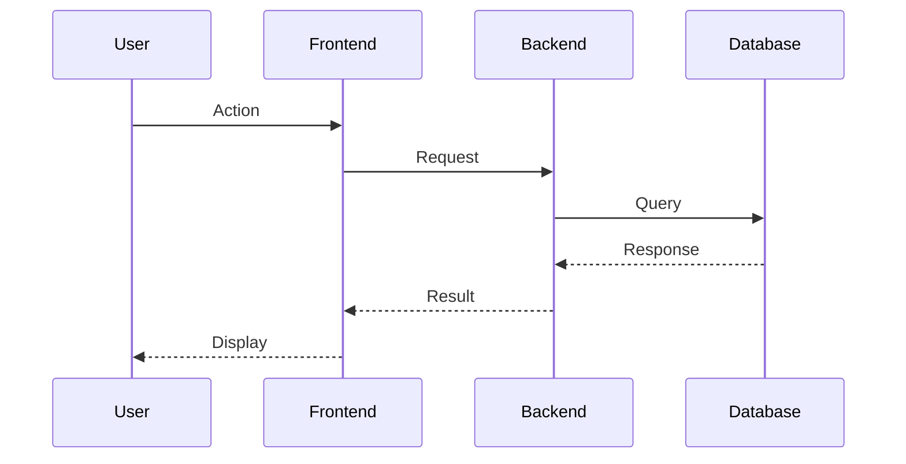

# Feature Documentation Template

> **Document Version:** 1.0  
> **Last Updated:** {DATE}  
> **Status:** {Draft|Review|Published|Deprecated}  
> **Author(s):** {Author Names}  
> **Reviewers:** {Reviewer Names}

## Table of Contents

1. [Executive Summary](#executive-summary)
2. [Feature Overview](#feature-overview)
3. [Business Requirements](#business-requirements)
4. [Technical Specification](#technical-specification)
5. [Architecture & Design](#architecture--design)
6. [Implementation Guide](#implementation-guide)
7. [API Documentation](#api-documentation)
8. [User Guide](#user-guide)
9. [Testing Strategy](#testing-strategy)
10. [Security Considerations](#security-considerations)
11. [Performance Metrics](#performance-metrics)
12. [Deployment Instructions](#deployment-instructions)
13. [Monitoring & Maintenance](#monitoring--maintenance)
14. [FAQ & Troubleshooting](#faq--troubleshooting)
15. [References](#references)

---

## Executive Summary

{Provide a 2-3 paragraph high-level summary of the feature, its purpose, and key
benefits. This should be understandable by non-technical stakeholders.}

**Key Benefits:**

- {Benefit 1}
- {Benefit 2}
- {Benefit 3}

**Target Users:**

- {User Type 1}
- {User Type 2}

---

## Feature Overview

### Purpose

{Describe the primary purpose and goals of this feature}

### Scope

**In Scope:**

- {Item 1}
- {Item 2}

**Out of Scope:**

- {Item 1}
- {Item 2}

### Dependencies

| Dependency | Type                | Version   | Purpose   |
| ---------- | ------------------- | --------- | --------- |
| {Name}     | {Internal/External} | {Version} | {Purpose} |

### Constraints

- {Constraint 1}
- {Constraint 2}

---

## Business Requirements

### User Stories

#### Story 1: {Title}

**As a** {user type}  
**I want to** {action}  
**So that** {benefit}

**Acceptance Criteria:**

- [ ] {Criterion 1}
- [ ] {Criterion 2}

### Success Metrics

| Metric        | Target         | Measurement Method |
| ------------- | -------------- | ------------------ |
| {Metric Name} | {Target Value} | {How to measure}   |

---

## Technical Specification

### Technology Stack

- **Backend:** {Technologies used}
- **Frontend:** {Technologies used}
- **Database:** {Database type and version}
- **Cache:** {Caching solution}
- **Queue:** {Message queue if applicable}

### Data Models

```typescript
// Example data model
interface {ModelName} {
  id: string;
  // Add fields here
}
```

### System Requirements

- **CPU:** {Requirements}
- **Memory:** {Requirements}
- **Storage:** {Requirements}
- **Network:** {Requirements}

---

## Architecture & Design

### High-Level Architecture



### Design Patterns

- **Pattern 1:** {Description and usage}
- **Pattern 2:** {Description and usage}

### Sequence Diagrams



---

## Implementation Guide

### Prerequisites

- {Prerequisite 1}
- {Prerequisite 2}

### Step-by-Step Implementation

#### Step 1: {Title}

```bash
# Example command
{command}
```

{Detailed explanation}

#### Step 2: {Title}

```typescript
// Example code
{
  code;
}
```

{Detailed explanation}

### Configuration

```yaml
# Example configuration
feature:
  enabled: true
  options:
    option1: value1
    option2: value2
```

---

## API Documentation

### Endpoints

#### {METHOD} /api/v1/{endpoint}

**Description:** {What this endpoint does}

**Authentication:** {Required authentication method}

**Request:**

```json
{
  "field1": "value1",
  "field2": "value2"
}
```

**Response:**

```json
{
  "success": true,
  "data": {
    "field1": "value1"
  }
}
```

**Error Codes:** | Code | Description | Resolution |
|------|-------------|------------| | 400 | Bad Request | {How to fix} | | 401 |
Unauthorized | {How to fix} |

### GraphQL Schema (if applicable)

```graphql
type {TypeName} {
  id: ID!
  # Add fields
}

type Query {
  # Add queries
}

type Mutation {
  # Add mutations
}
```

---

## User Guide

### Getting Started

1. **Access the Feature**
   - Navigate to {location}
   - Click on {button/link}

2. **Basic Usage**
   - {Step 1}
   - {Step 2}

### Advanced Features

#### Feature 1: {Name}

{Description and usage instructions}

### Tips & Best Practices

- {Tip 1}
- {Tip 2}

---

## Testing Strategy

### Test Coverage Requirements

- **Unit Tests:** {Coverage %}
- **Integration Tests:** {Coverage %}
- **E2E Tests:** {Coverage %}

### Test Cases

#### Test Case 1: {Name}

**Objective:** {What we're testing} **Steps:**

1. {Step 1}
2. {Step 2} **Expected Result:** {Expected outcome}

### Performance Testing

- **Load Testing:** {Approach and targets}
- **Stress Testing:** {Approach and limits}

---

## Security Considerations

### Authentication & Authorization

- {Security measure 1}
- {Security measure 2}

### Data Protection

- **Encryption:** {Methods used}
- **Data Retention:** {Policy}
- **Access Control:** {Implementation}

### Security Checklist

- [ ] Input validation implemented
- [ ] SQL injection prevention
- [ ] XSS protection
- [ ] CSRF protection
- [ ] Rate limiting configured

---

## Performance Metrics

### Target Metrics

| Metric        | Target      | Actual   | Status   |
| ------------- | ----------- | -------- | -------- |
| Response Time | <200ms      | {actual} | {status} |
| Throughput    | >1000 req/s | {actual} | {status} |
| Error Rate    | <0.1%       | {actual} | {status} |

### Optimization Strategies

- {Strategy 1}
- {Strategy 2}

---

## Deployment Instructions

### Pre-deployment Checklist

- [ ] All tests passing
- [ ] Documentation updated
- [ ] Environment variables configured
- [ ] Database migrations ready
- [ ] Rollback plan prepared

### Deployment Steps

1. **Prepare Environment**

   ```bash
   {commands}
   ```

2. **Deploy Application**

   ```bash
   {commands}
   ```

3. **Post-deployment Verification**
   ```bash
   {commands}
   ```

### Rollback Procedure

{Step-by-step rollback instructions}

---

## Monitoring & Maintenance

### Key Metrics to Monitor

- {Metric 1}: {Description and threshold}
- {Metric 2}: {Description and threshold}

### Alerts Configuration

```yaml
alerts:
  - name: { Alert Name }
    condition: { Condition }
    threshold: { Value }
    action: { What to do }
```

### Maintenance Tasks

| Task   | Frequency              | Responsible Team |
| ------ | ---------------------- | ---------------- |
| {Task} | {Daily/Weekly/Monthly} | {Team}           |

---

## FAQ & Troubleshooting

### Frequently Asked Questions

**Q: {Question}**  
A: {Answer}

**Q: {Question}**  
A: {Answer}

### Common Issues

#### Issue: {Problem Description}

**Symptoms:** {What user sees} **Cause:** {Root cause} **Solution:**

1. {Step 1}
2. {Step 2}

#### Debug Commands

```bash
# Useful debugging commands
{command 1}
{command 2}
```

---

## References

### Internal Documentation

- [{Document Name}](link) - {Description}
- [{Document Name}](link) - {Description}

### External Resources

- [{Resource Name}](link) - {Description}
- [{Resource Name}](link) - {Description}

### Related Features

- [{Feature Name}](link) - {How it relates}
- [{Feature Name}](link) - {How it relates}

---

## Revision History

| Version   | Date   | Author   | Changes         |
| --------- | ------ | -------- | --------------- |
| 1.0       | {Date} | {Author} | Initial version |
| {Version} | {Date} | {Author} | {Changes}       |

---

## Approval Sign-off

| Role            | Name   | Date   | Signature   |
| --------------- | ------ | ------ | ----------- |
| Technical Lead  | {Name} | {Date} | {Signature} |
| Product Manager | {Name} | {Date} | {Signature} |
| QA Lead         | {Name} | {Date} | {Signature} |
| Security Lead   | {Name} | {Date} | {Signature} |
