# Technical Specification Document Template

> **Document Version:** 1.0  
> **Last Updated:** {DATE}  
> **Status:** {Draft|Under Review|Approved|Deprecated}  
> **Author(s):** {Names}  
> **Reviewer(s):** {Names}  
> **Approval:** {Name, Date}

## Executive Summary

{Provide a high-level overview of the technical solution, its purpose, and key
technical decisions. This should be understandable by both technical and
non-technical stakeholders.}

**Key Points:**

- {Main technical approach}
- {Primary technologies used}
- {Expected outcome}

---

## Table of Contents

1. [Introduction](#introduction)
2. [System Overview](#system-overview)
3. [Technical Requirements](#technical-requirements)
4. [System Architecture](#system-architecture)
5. [Data Design](#data-design)
6. [API Design](#api-design)
7. [Security Design](#security-design)
8. [Performance Specifications](#performance-specifications)
9. [Infrastructure Requirements](#infrastructure-requirements)
10. [Testing Strategy](#testing-strategy)
11. [Deployment Plan](#deployment-plan)
12. [Monitoring & Maintenance](#monitoring--maintenance)
13. [Risk Analysis](#risk-analysis)
14. [Timeline & Milestones](#timeline--milestones)
15. [Appendices](#appendices)

---

## Introduction

### Purpose

{Describe the purpose of this technical specification and what problem it
solves}

### Scope

{Define what is included and excluded from this specification}

**In Scope:**

- {Item 1}
- {Item 2}

**Out of Scope:**

- {Item 1}
- {Item 2}

### Definitions & Acronyms

| Term      | Definition                        |
| --------- | --------------------------------- |
| {Term}    | {Definition}                      |
| API       | Application Programming Interface |
| {Acronym} | {Full form and explanation}       |

### References

- [{Document Name}](link) - {Brief description}
- [{Specification}](link) - {Brief description}

---

## System Overview

### Current State

{Describe the current system/situation if applicable}

### Proposed Solution

{High-level description of the proposed technical solution}

### Key Components

1. **{Component 1}** - {Brief description}
2. **{Component 2}** - {Brief description}
3. **{Component 3}** - {Brief description}

### System Context Diagram


---

## Technical Requirements

### Functional Requirements

#### FR-001: {Requirement Name}

- **Description:** {Detailed description}
- **Priority:** {High|Medium|Low}
- **Acceptance Criteria:**
  - {Criterion 1}
  - {Criterion 2}

#### FR-002: {Requirement Name}

- **Description:** {Detailed description}
- **Priority:** {High|Medium|Low}
- **Acceptance Criteria:**
  - {Criterion 1}
  - {Criterion 2}

### Non-Functional Requirements

#### Performance Requirements

| Requirement      | Target                     | Measurement                  |
| ---------------- | -------------------------- | ---------------------------- |
| Response Time    | <200ms for 95% of requests | API endpoint latency         |
| Throughput       | >1000 TPS                  | Transactions per second      |
| Concurrent Users | 10,000                     | Simultaneous active sessions |

#### Scalability Requirements

- Horizontal scaling capability
- Auto-scaling based on load
- Support for multi-region deployment

#### Reliability Requirements

- **Availability:** 99.9% uptime (8.76 hours downtime/year)
- **MTBF:** >720 hours
- **MTTR:** <1 hour
- **RPO:** 1 hour
- **RTO:** 2 hours

#### Security Requirements

- {Security requirement 1}
- {Security requirement 2}
- Compliance with {standard/regulation}

---

## System Architecture

### Architecture Overview

{Describe the overall architecture pattern and key decisions}

### Architecture Diagram


### Component Specifications

#### Component 1: {Name}

- **Technology:** {Technology stack}
- **Responsibilities:**
  - {Responsibility 1}
  - {Responsibility 2}
- **Interfaces:**
  - Input: {Interface description}
  - Output: {Interface description}
- **Dependencies:** {List dependencies}

### Design Patterns

- **{Pattern Name}:** {Usage and justification}
- **{Pattern Name}:** {Usage and justification}

### Technology Stack

| Layer    | Technology     | Version   | Justification                           |
| -------- | -------------- | --------- | --------------------------------------- |
| Frontend | React          | 18.x      | Component reusability, ecosystem        |
| Backend  | Node.js/NestJS | 20.x/10.x | TypeScript support, enterprise features |
| Database | PostgreSQL     | 15.x      | ACID compliance, JSON support           |
| Cache    | Redis          | 7.x       | Performance, pub/sub capabilities       |
| Queue    | RabbitMQ       | 3.12.x    | Reliability, routing flexibility        |

---

## Data Design

### Data Architecture

{Describe the overall data architecture approach}

### Entity Relationship Diagram

```mermaid
erDiagram
    User ||--o{ Order : places
    Order ||--|{ OrderItem : contains
    Product ||--o{ OrderItem : includes
    User {
        string id PK
        string email UK
        string name
        datetime created_at
    }
    Order {
        string id PK
        string user_id FK
        decimal total_amount
        string status
        datetime created_at
    }
    OrderItem {
        string id PK
        string order_id FK
        string product_id FK
        int quantity
        decimal price
    }
    Product {
        string id PK
        string name
        decimal price
        int stock
    }
```



### Database Schema

#### Table: users

| Column     | Type         | Constraints             | Description           |
| ---------- | ------------ | ----------------------- | --------------------- |
| id         | UUID         | PRIMARY KEY             | Unique identifier     |
| email      | VARCHAR(255) | UNIQUE, NOT NULL        | User email            |
| name       | VARCHAR(255) | NOT NULL                | User full name        |
| created_at | TIMESTAMP    | NOT NULL, DEFAULT NOW() | Creation timestamp    |
| updated_at | TIMESTAMP    | NOT NULL                | Last update timestamp |

#### Indexes

- `idx_users_email` on `email` column
- `idx_users_created_at` on `created_at` column

### Data Migration Strategy

{If applicable, describe how existing data will be migrated}

### Data Retention Policy

| Data Type        | Retention Period | Archive Strategy          |
| ---------------- | ---------------- | ------------------------- |
| User Data        | Indefinite       | N/A                       |
| Transaction Logs | 7 years          | Cold storage after 1 year |
| System Logs      | 90 days          | Compressed archive        |

---

## API Design

### API Standards

- RESTful design principles
- JSON request/response format
- Versioning strategy: URL path (e.g., /api/v1/)
- Authentication: Bearer token (JWT)

### API Endpoints

#### User Management

##### GET /api/v1/users/{id}

**Description:** Retrieve user details

**Request:**

```http
GET /api/v1/users/123e4567-e89b-12d3-a456-426614174000
Authorization: Bearer {token}
```

**Response:**

```json
{
  "id": "123e4567-e89b-12d3-a456-426614174000",
  "email": "user@example.com",
  "name": "John Doe",
  "created_at": "2024-07-06T10:00:00Z"
}
```

##### POST /api/v1/users

**Description:** Create new user

**Request:**

```json
{
  "email": "newuser@example.com",
  "name": "Jane Doe",
  "password": "securepassword"
}
```

**Response:**

```json
{
  "id": "123e4567-e89b-12d3-a456-426614174000",
  "email": "newuser@example.com",
  "name": "Jane Doe",
  "created_at": "2024-07-06T10:00:00Z"
}
```

### GraphQL Schema (if applicable)

```graphql
type User {
  id: ID!
  email: String!
  name: String!
  orders: [Order!]!
  createdAt: DateTime!
}

type Query {
  user(id: ID!): User
  users(limit: Int, offset: Int): [User!]!
}

type Mutation {
  createUser(input: CreateUserInput!): User!
  updateUser(id: ID!, input: UpdateUserInput!): User!
}
```

### Error Handling

#### Standard Error Response

```json
{
  "error": {
    "code": "VALIDATION_ERROR",
    "message": "Invalid input data",
    "details": [
      {
        "field": "email",
        "message": "Invalid email format"
      }
    ],
    "timestamp": "2024-07-06T10:00:00Z",
    "requestId": "req_123456"
  }
}
```

#### Error Codes

| Code             | HTTP Status | Description              |
| ---------------- | ----------- | ------------------------ |
| VALIDATION_ERROR | 400         | Invalid input data       |
| UNAUTHORIZED     | 401         | Authentication required  |
| FORBIDDEN        | 403         | Insufficient permissions |
| NOT_FOUND        | 404         | Resource not found       |
| CONFLICT         | 409         | Resource conflict        |
| INTERNAL_ERROR   | 500         | Server error             |

---

## Security Design

### Security Architecture


### Authentication & Authorization

#### Authentication Flow

1. User provides credentials
2. System validates credentials
3. JWT token issued (15-minute expiry)
4. Refresh token issued (7-day expiry)
5. Token included in subsequent requests

#### Authorization Model

- Role-Based Access Control (RBAC)
- Permissions mapped to roles
- Roles assigned to users

### Security Measures

#### Application Security

- Input validation on all endpoints
- SQL injection prevention via parameterized queries
- XSS prevention through output encoding
- CSRF protection using tokens
- Rate limiting: 100 requests/minute per user

#### Data Security

- Encryption at rest: AES-256
- Encryption in transit: TLS 1.3
- PII data masking in logs
- Secure key management using HSM

#### Infrastructure Security

- Network segmentation
- Firewall rules
- Regular security patching
- Intrusion detection system

### Compliance

- GDPR compliance for EU users
- PCI DSS for payment processing
- SOC 2 Type II certification

---

## Performance Specifications

### Performance Targets

| Metric              | Target                   | Measurement Method   |
| ------------------- | ------------------------ | -------------------- |
| Page Load Time      | <2 seconds               | Synthetic monitoring |
| API Response Time   | <200ms (95th percentile) | APM tools            |
| Database Query Time | <50ms (average)          | Database monitoring  |
| Throughput          | 1000 requests/second     | Load testing         |
| Concurrent Users    | 10,000                   | Load testing         |

### Performance Optimization Strategies

#### Caching Strategy

- **Browser Cache:** Static assets (1 year)
- **CDN Cache:** Images and media (1 month)
- **Application Cache:** User sessions (15 minutes)
- **Database Cache:** Frequently accessed data (5 minutes)

#### Database Optimization

- Proper indexing strategy
- Query optimization
- Connection pooling
- Read replicas for scaling

#### Application Optimization

- Code splitting and lazy loading
- Image optimization and WebP format
- Minification and compression
- Asynchronous processing for heavy operations

### Load Testing Plan

#### Test Scenarios

1. **Normal Load:** 500 concurrent users
2. **Peak Load:** 2000 concurrent users
3. **Stress Test:** 5000 concurrent users
4. **Spike Test:** 0 to 1000 users in 1 minute

#### Success Criteria

- No errors under normal load
- <5% error rate under peak load
- Graceful degradation under stress
- Auto-scaling triggers correctly

---

## Infrastructure Requirements

### Environment Specifications

#### Development Environment

| Component | Specification                |
| --------- | ---------------------------- |
| Servers   | 2x t3.medium (AWS)           |
| Database  | db.t3.small (RDS)            |
| Cache     | cache.t3.micro (ElastiCache) |
| Storage   | 100 GB SSD                   |

#### Staging Environment

| Component | Specification                |
| --------- | ---------------------------- |
| Servers   | 4x t3.large (AWS)            |
| Database  | db.t3.medium (RDS)           |
| Cache     | cache.t3.small (ElastiCache) |
| Storage   | 500 GB SSD                   |

#### Production Environment

| Component     | Specification                |
| ------------- | ---------------------------- |
| Servers       | 8x c5.xlarge (AWS)           |
| Database      | db.r5.xlarge (RDS Multi-AZ)  |
| Cache         | cache.r5.large (ElastiCache) |
| Storage       | 2 TB SSD                     |
| CDN           | CloudFront                   |
| Load Balancer | Application Load Balancer    |

### Network Architecture


### Disaster Recovery

#### Backup Strategy

- **Database:** Daily automated backups, 30-day retention
- **Application Data:** Hourly snapshots
- **Configuration:** Version controlled in Git
- **Backup Location:** Cross-region replication

#### Recovery Procedures

1. **Data Recovery:** Restore from latest backup
2. **Application Recovery:** Deploy from Git repository
3. **Configuration Recovery:** Apply from version control
4. **Verification:** Run smoke tests

---

## Testing Strategy

### Testing Levels

#### Unit Testing

- **Coverage Target:** 80%
- **Framework:** Jest (JavaScript), pytest (Python)
- **Execution:** On every commit

#### Integration Testing

- **Coverage Target:** 70%
- **Focus:** API endpoints, database operations
- **Execution:** On pull requests

#### End-to-End Testing

- **Coverage:** Critical user paths
- **Framework:** Cypress/Playwright
- **Execution:** Before deployment

#### Performance Testing

- **Tool:** JMeter/K6
- **Frequency:** Weekly in staging
- **Metrics:** Response time, throughput, error rate

### Test Environments

| Environment | Purpose           | Data                 |
| ----------- | ----------------- | -------------------- |
| Unit Test   | Developer testing | Mocked               |
| Integration | API testing       | Test data            |
| E2E         | User flow testing | Synthetic data       |
| Performance | Load testing      | Production-like      |
| UAT         | User acceptance   | Sanitized production |

### Test Data Management

- Synthetic data generation
- Data masking for production copies
- Test data cleanup procedures
- GDPR compliance for test data

---

## Deployment Plan

### Deployment Strategy

#### Blue-Green Deployment


### CI/CD Pipeline


### Deployment Checklist

#### Pre-deployment

- [ ] Code review completed
- [ ] All tests passing
- [ ] Security scan passed
- [ ] Performance benchmarks met
- [ ] Documentation updated
- [ ] Database migrations tested
- [ ] Rollback plan prepared

#### Deployment

- [ ] Backup current version
- [ ] Apply database migrations
- [ ] Deploy to subset of servers
- [ ] Smoke test deployed version
- [ ] Monitor error rates
- [ ] Gradual traffic shift
- [ ] Full deployment

#### Post-deployment

- [ ] Verify all services healthy
- [ ] Check performance metrics
- [ ] Monitor error logs
- [ ] User acceptance verification
- [ ] Update status page
- [ ] Team notification

### Rollback Plan

1. **Immediate Rollback Triggers:**
   - Error rate >5%
   - Response time >2x baseline
   - Critical functionality failure

2. **Rollback Procedure:**
   - Switch load balancer to previous version
   - Revert database migrations if needed
   - Clear caches
   - Notify team
   - Investigate root cause

---

## Monitoring & Maintenance

### Monitoring Strategy

#### Application Monitoring

- **APM Tool:** New Relic/DataDog
- **Metrics:** Response time, error rate, throughput
- **Custom Metrics:** Business KPIs
- **Log Aggregation:** ELK Stack

#### Infrastructure Monitoring

- **Tool:** CloudWatch/Prometheus
- **Metrics:** CPU, memory, disk, network
- **Alerts:** Threshold-based and anomaly detection

#### Synthetic Monitoring

- **Tool:** Pingdom/Synthetics
- **Checks:** Critical user flows
- **Frequency:** Every 5 minutes
- **Locations:** Multiple geographic regions

### Alert Configuration

| Alert                    | Condition              | Severity | Action             |
| ------------------------ | ---------------------- | -------- | ------------------ |
| High Error Rate          | >5% errors for 5 min   | Critical | Page on-call       |
| Slow Response            | >1s average for 10 min | Warning  | Email team         |
| Low Disk Space           | <10% free              | Warning  | Auto-scale storage |
| Database Connection Pool | >80% utilized          | Warning  | Scale connections  |

### Maintenance Windows

- **Regular Maintenance:** Sunday 2-4 AM UTC
- **Security Patches:** As needed (critical within 24h)
- **Version Updates:** Monthly
- **Database Maintenance:** Quarterly

### Operational Procedures

#### Daily Tasks

- Review monitoring dashboards
- Check overnight alerts
- Verify backup completion
- Review error logs

#### Weekly Tasks

- Performance report generation
- Capacity planning review
- Security scan results
- Update documentation

#### Monthly Tasks

- Disaster recovery test
- Access review
- Cost optimization review
- Team training/knowledge sharing

---

## Risk Analysis

### Technical Risks

| Risk                    | Probability | Impact   | Mitigation Strategy                     |
| ----------------------- | ----------- | -------- | --------------------------------------- |
| Database failure        | Low         | High     | Multi-AZ deployment, regular backups    |
| DDoS attack             | Medium      | High     | WAF, rate limiting, auto-scaling        |
| Data breach             | Low         | Critical | Encryption, access controls, monitoring |
| Third-party API failure | Medium      | Medium   | Circuit breakers, fallback options      |
| Performance degradation | Medium      | Medium   | Monitoring, auto-scaling, optimization  |

### Project Risks

| Risk                  | Probability | Impact | Mitigation Strategy                    |
| --------------------- | ----------- | ------ | -------------------------------------- |
| Scope creep           | High        | Medium | Clear requirements, change control     |
| Technical debt        | Medium      | Low    | Regular refactoring, code reviews      |
| Key person dependency | Medium      | High   | Documentation, knowledge sharing       |
| Budget overrun        | Low         | Medium | Regular monitoring, reserved instances |

### Contingency Plans

#### Critical Service Failure

1. Activate incident response team
2. Implement temporary workaround
3. Communicate with stakeholders
4. Execute recovery plan
5. Post-mortem analysis

#### Data Loss

1. Stop write operations
2. Assess extent of loss
3. Restore from backup
4. Verify data integrity
5. Resume operations

---

## Timeline & Milestones

### Project Phases


### Key Milestones

| Milestone         | Date       | Deliverables                          |
| ----------------- | ---------- | ------------------------------------- |
| Design Complete   | 2024-07-28 | Technical spec, architecture diagrams |
| Alpha Release     | 2024-08-28 | Core functionality complete           |
| Beta Release      | 2024-09-22 | Feature complete, testing begins      |
| Release Candidate | 2024-10-13 | Production ready                      |
| Go Live           | 2024-10-17 | Full production deployment            |

### Success Criteria

1. All functional requirements implemented
2. Performance targets met
3. Security audit passed
4. User acceptance achieved
5. Documentation complete

---

## Appendices

### Appendix A: Glossary

| Term   | Definition            |
| ------ | --------------------- |
| {Term} | {Detailed definition} |

### Appendix B: References

1. [{Reference Title}](link) - {Description}
2. [{Reference Title}](link) - {Description}

### Appendix C: Decision Log

| Date   | Decision   | Rationale | Made By  |
| ------ | ---------- | --------- | -------- |
| {Date} | {Decision} | {Reason}  | {Person} |

### Appendix D: Change History

| Version | Date   | Author   | Changes                |
| ------- | ------ | -------- | ---------------------- |
| 0.1     | {Date} | {Author} | Initial draft          |
| 1.0     | {Date} | {Author} | First complete version |

---

## Approval

| Role              | Name   | Signature   | Date   |
| ----------------- | ------ | ----------- | ------ |
| Technical Lead    | {Name} | {Signature} | {Date} |
| Product Manager   | {Name} | {Signature} | {Date} |
| Architecture Team | {Name} | {Signature} | {Date} |
| Security Team     | {Name} | {Signature} | {Date} |

---

**Document End**

_This document is confidential and proprietary. Distribution is limited to
authorized personnel only._
