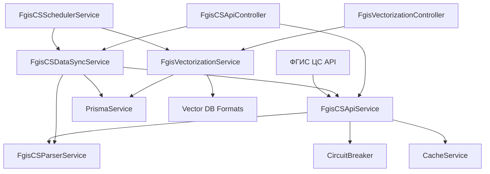

# Документация модуля ФГИС ЦС API

> **Версия:** 1.0
> **Дата:** 15.07.2025
> **Статус:** Активный
> **Авторы:** Команда разработки Estimate Service

## Содержание

- [Обзор](#обзор)
- [Архитектура](#архитектура)
- [API Reference](#api-reference)
- [Интеграция](#интеграция)
- [Векторизация данных](#векторизация-данных)
- [Конфигурация](#конфигурация)
- [Мониторинг](#мониторинг)
- [Устранение неполадок](#устранение-неполадок)

---

## Обзор

Модуль ФГИС ЦС API предоставляет интеграцию с Федеральной государственной информационной системой ценообразования в строительстве (ФГИС ЦС). Модуль обеспечивает доступ к реестру сметных нормативов, автоматическую синхронизацию данных и векторизацию для использования в RAG системах.

### Основные возможности

- 🔄 Автоматическая синхронизация данных из ФГИС ЦС
- 📊 Доступ к классификатору строительных ресурсов (КСР)
- 💰 Получение ценовых зон и региональных коэффициентов
- 📈 Работа с федеральными сметными нормативами (ФСНБ)
- 🤖 Векторизация данных для ИИ-систем
- ⏰ Планировщик для регулярного обновления данных

## Архитектура

### Диаграмма компонентов



### Компоненты модуля

| Компонент | Назначение |
|-----------|------------|
| `FgisCSApiService` | Основной сервис для работы с API ФГИС ЦС |
| `FgisCSDataSyncService` | Синхронизация данных с локальной БД |
| `FgisCSParserService` | Парсинг различных форматов данных (XML, CSV) |
| `FgisVectorizationService` | Векторизация данных для RAG систем |
| `FgisCSSchedulerService` | Автоматическая синхронизация по расписанию |
| `FgisCSConfigService` | Управление конфигурацией модуля |

## API Reference

### Endpoints

#### GET /api/fgis-cs/datasets

Получить список доступных наборов данных ФГИС ЦС.

**Пример запроса:**
```http
GET /api/fgis-cs/datasets
Authorization: Bearer <token>
```

**Пример ответа:**
```json
[
  {
    "identifier": "7707082071-ksr",
    "title": "Классификатор строительных ресурсов",
    "format": "csv",
    "link": "https://fgiscs.minstroyrf.ru/api/opendata/7707082071-ksr/meta.csv"
  }
]
```

#### GET /api/fgis-cs/ksr

Получить данные классификатора строительных ресурсов.

**Параметры запроса:**
- `code` (опционально): Фильтр по коду ресурса
- `name` (опционально): Фильтр по наименованию
- `category` (опционально): Фильтр по категории

**Пример запроса:**
```http
GET /api/fgis-cs/ksr?category=Материалы&name=бетон
```

#### POST /api/fgis-cs/sync

Запустить синхронизацию всех данных из ФГИС ЦС.

**Пример ответа:**
```json
{
  "status": "COMPLETED",
  "syncedTypes": ["KSR", "PRICE_ZONES", "LABOR_COSTS", "FSNB_2022"],
  "errors": []
}
```

#### POST /api/fgis-cs/vectorization/vectorize

Векторизировать данные для использования в RAG системах.

**Пример ответа:**
```json
{
  "success": true,
  "totalChunks": 15420,
  "chromaFormat": "/path/to/chroma_format.json",
  "langchainFormat": "/path/to/langchain_format.json",
  "llamaIndexFormat": "/path/to/llama_index_format.json"
}
```

## Интеграция

### Добавление модуля в приложение

```typescript
import { FgisCSApiModule } from './modules/fgis-cs-api/fgis-cs-api.module';

@Module({
  imports: [
    // другие модули...
    FgisCSApiModule,
  ],
})
export class AppModule {}
```

### Использование в других сервисах

```typescript
import { FgisCSApiService } from '../fgis-cs-api/fgis-cs-api.service';

@Injectable()
export class EstimateService {
  constructor(
    private readonly fgisService: FgisCSApiService,
  ) {}

  async calculateWithFSNB(code: string) {
    const fsnbData = await this.fgisService.getFSNBData('2022', { code });
    // Использование данных ФСНБ для расчетов...
  }
}
```

## Векторизация данных

### Форматы векторных баз данных

Модуль поддерживает экспорт в следующие форматы:

1. **ChromaDB**
   ```json
   {
     "id": "ksr_01.01.001",
     "document": "Бетон класса B25. Единица измерения: м³.",
     "metadata": {
       "type": "ksr_data",
       "category": "Материалы",
       "code": "01.01.001"
     }
   }
   ```

2. **LangChain**
   ```json
   {
     "page_content": "Бетон класса B25. Единица измерения: м³.",
     "metadata": {
       "type": "ksr_data",
       "category": "Материалы"
     }
   }
   ```

3. **LlamaIndex**
   ```json
   {
     "text": "Бетон класса B25. Единица измерения: м³.",
     "doc_id": "ksr_01.01.001",
     "extra_info": {
       "type": "ksr_data"
     }
   }
   ```

### Использование векторизованных данных

```python
import chromadb
import json

# Загрузка данных
with open('vector_db_ready/chroma_format.json', 'r', encoding='utf-8') as f:
    data = json.load(f)

# Создание коллекции
client = chromadb.PersistentClient(path="./chroma_db")
collection = client.create_collection("construction_knowledge")

# Добавление документов
collection.add(
    documents=[d['document'] for d in data],
    metadatas=[d['metadata'] for d in data],
    ids=[d['id'] for d in data]
)

# Поиск
results = collection.query(
    query_texts=["земляные работы экскаватор"],
    n_results=10
)
```

## Конфигурация

### Переменные окружения

```env
# API ФГИС ЦС
FGIS_CS_API_URL=https://fgiscs.minstroyrf.ru/api
FGIS_CS_API_KEY=your-api-key-here

# Настройки синхронизации
FGIS_CS_REQUEST_TIMEOUT=30000
FGIS_CS_MAX_RETRIES=3
FGIS_CS_CACHE_TTL=86400
FGIS_CS_BATCH_SIZE=100

# Автоматическая синхронизация
FGIS_CS_ENABLE_AUTO_SYNC=true
FGIS_CS_SYNC_SCHEDULE="0 3 * * *"
```

### Расписание синхронизации

Модуль поддерживает следующие расписания:

- **Ежедневная синхронизация**: 3:00 по московскому времени
- **Еженедельная полная синхронизация**: Воскресенье, 2:00 по московскому времени
- **Проверка обновлений**: Каждые 6 часов

## Мониторинг

### Метрики

- `fgis_cs_sync_duration`: Длительность синхронизации
- `fgis_cs_sync_errors`: Количество ошибок синхронизации
- `fgis_cs_api_requests`: Количество запросов к API
- `fgis_cs_cache_hits`: Количество попаданий в кэш

### Логирование

Все операции логируются с соответствующими уровнями:

```typescript
this.logger.log('Starting scheduled daily sync...');
this.logger.error('Failed to sync data:', error);
this.logger.warn('API rate limit approaching');
```

## Устранение неполадок

### Частые ошибки

#### Ошибка: "FGIS_API_UNAVAILABLE"
**Причина:** API ФГИС ЦС недоступен.
**Решение:** Проверьте подключение к интернету и доступность API.

#### Ошибка: "FGIS_PARSE_ERROR"
**Причина:** Неверный формат данных от API.
**Решение:** Проверьте актуальность парсера и формат ответа API.

#### Ошибка: "FGIS_RATE_LIMIT_EXCEEDED"
**Причина:** Превышен лимит запросов к API.
**Решение:** Увеличьте интервал между запросами или используйте кэш.

### Диагностика

```bash
# Проверка статуса синхронизации
curl http://localhost:3001/api/fgis-cs/sync/statistics

# Проверка доступности API
curl http://localhost:3001/api/fgis-cs/datasets

# Просмотр логов
docker logs estimate-service | grep FgisCS
```

---
*Документ обновлен: 15.07.2025*
*Версия: 1.0*
*Авторы: Команда разработки Estimate Service*
*Статус: Активный*
